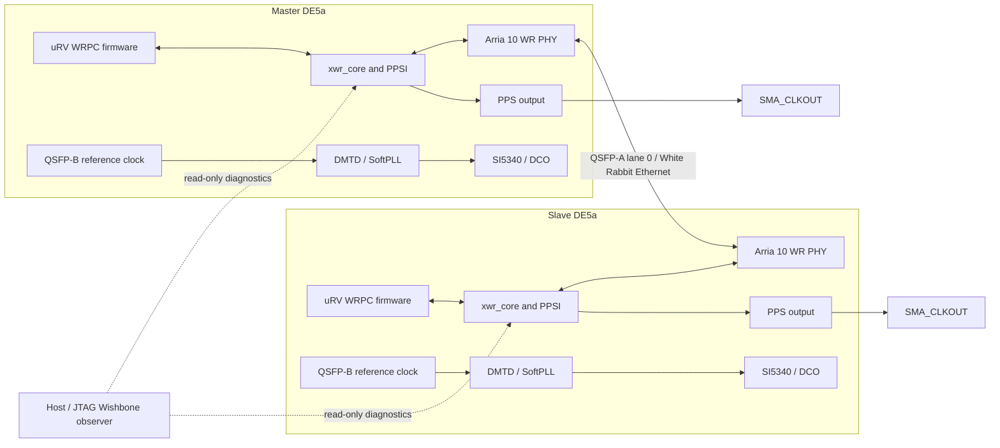

# DE5a White Rabbit

This repository develops and records the two-board White Rabbit system on Terasic DE5a / Arria 10. The only intended current hardware workflow is the JTAG-based Master/Slave design; frozen milestone snapshots preserve each validated research checkpoint.

## System architecture



The diagram is a functional overview, not a pin-level schematic. Each board runs the White Rabbit core and WRPC firmware; the Master and Slave roles use unique endpoint identities. QSFP-A lane 0 is the fixed inter-board WR data path. The DMTD / SoftPLL and SI5340/DCO form the local clock-control path. PPS is available at `SMA_CLKOUT`. JTAG Wishbone scripts are the runtime observability interface.

Canonical Quartus top-level entities:

```text
DE5a_wr_master_jtag
DE5a_wr_slave_jtag
```

## Current milestone status

Step 1 PHY/link, Step 2 Endpoint/MiniNIC/PTP, and Step 3 WR parent/signaling handshake have independently rebuilt, programmed, and runtime-validated frozen checkpoints. Step 3 PASS is limited to handshake acceptance; it does not claim SoftPLL lock or valid global time. Earlier Step 5 / Step 6 functional experiment evidence exists, but their independent frozen-source milestone reproductions are still pending. The authoritative status, source/SOF hashes, and evidence links are in [`STATUS.md`](STATUS.md) and [`MILESTONES.md`](MILESTONES.md).

## Reproduce the current validated Step 2 checkpoint

Quartus Prime Standard Edition 17.0.0 Build 595 and the RISC-V firmware toolchain are used by the validated milestone. On Pain, set the Quartus executables and toolchain `PATH`, then run from the repository root:

```sh
cd artifacts/milestones/step2_endpoint_ptp/source
bash scripts/build/build_master.sh
bash scripts/build/build_slave.sh
JTAG_CABLE='DE5 [1-11.1]' bash scripts/program/program_master.sh
JTAG_CABLE='DE5 [1-11.2]' bash scripts/program/program_slave.sh
```

The programming wrappers use the freshly built JTAG images in that frozen source directory. The validated order for this Step 2 reproduction was Master then Slave. Build success alone is not runtime validation; use the acceptance procedure in the milestone README and experiment report.

## Reproduce the validated Step 3 checkpoint

The exact Step 3 SOF files programmed and validated on 2026-09-24 are:

- Master: [`artifacts/milestones/step3_wr_handshake/master.sof`](artifacts/milestones/step3_wr_handshake/master.sof)
- Slave: [`artifacts/milestones/step3_wr_handshake/slave.sof`](artifacts/milestones/step3_wr_handshake/slave.sof)

On Pain, the independent build outputs are under
`artifacts/milestones/step3_wr_handshake/source/quartus/output_files_master_jtag/DE5a_wr_master_jtag.sof`
and
`artifacts/milestones/step3_wr_handshake/source/quartus/output_files_slave_jtag/DE5a_wr_slave_jtag.sof`.
Their SHA-256 hashes match the two files above. Program Master first, then
Slave, using the wrappers in
`artifacts/milestones/step3_wr_handshake/source/scripts/program/`. See the
[Step 3 milestone README](artifacts/milestones/step3_wr_handshake/README.md)
for the exact verification boundary and limitations.

## Source and evidence layout

The repository-wide source cleanup is in progress. The present working tree still has the JTAG projects nested under `quartus/jtag_runtime_diag/`, generated Quartus inputs under `generated/`, and the SI5340 controller under `rtl/clock/si5340_controller/`; these locations will be consolidated after the current milestone sequence. Do not use legacy/non-JTAG project paths for current development.

- `artifacts/milestones/stepX_*/source/` is a frozen, self-contained historical checkpoint. Do not edit it for ordinary development.
- `experiments/stepX/EXP-.../` stores each experiment's plan, raw build/program logs, runtime captures, analysis, report, and checksums.
- `firmware/`, `vendor/`, and `scripts/` are version-controlled inputs or tools; disposable Quartus databases and build outputs are not milestone source.

Every milestone has its own source snapshot and is marked PASS only after that snapshot is clean-built, programmed on both DE5a boards, and passes its own runtime acceptance criteria. Never use a later-Step SOF to stand in for an earlier milestone. Historical SOF hash mismatches are recorded, not hidden. Timing closure is reported separately and is not silently inferred from functional PASS.

See [`artifacts/README.md`](artifacts/README.md) for artifact policy and [`experiments/README.md`](experiments/README.md) for evidence conventions.
