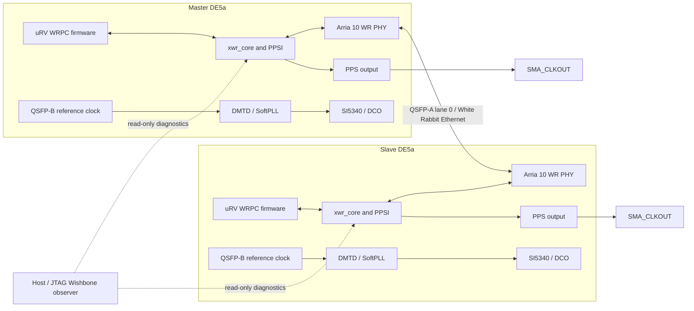

# DE5a White Rabbit

This repository develops and records the two-board White Rabbit system on Terasic DE5a / Arria 10. The only intended current hardware workflow is the JTAG-based Master/Slave design; frozen milestone snapshots preserve each validated research checkpoint.

## System architecture



The diagram is a functional overview, not a pin-level schematic. Each board runs the White Rabbit core and WRPC firmware; the Master and Slave roles use unique endpoint identities. QSFP-A lane 0 is the fixed inter-board WR Ethernet data path. The local reference clock feeds DMTD; SoftPLL uses DMTD phase measurements to control the SI5340-based DCO. The WR core's PPS output is routed to `SMA_CLKOUT`. A healthy PHY/link indication alone does not prove valid PTP time, PPS, SoftPLL lock, or global-time agreement.

The current design uses the Arria 10 White Rabbit PHY and its required generated IP inputs. Master and Slave are separate JTAG Quartus projects with the top-level entities shown below. On Pain, the board cables are `DE5 [1-11.1]` for Master and `DE5 [1-11.2]` for Slave. Runtime status and Wishbone-register observation use the JTAG scripts under `scripts/jtag/`; the Step 1–6 dashboard is read-only.

The RS422-named pins in the JTAG top-level are retained only as the board's
WRPC physical-UART console sideband. They do not define a second White Rabbit
architecture or a build/program/diagnostic workflow; all current FPGA project
builds/programming and all milestone acceptance/diagnostic observations use
JTAG. The UART sideband may be used only as the WRPC text console.

Canonical Quartus top-level entities:

```text
DE5a_wr_master_jtag
DE5a_wr_slave_jtag
```

## Current milestone status

Step 1 PHY/link, Step 2 Endpoint/MiniNIC/PTP, Step 3 WR parent/signaling handshake, and Step 4 SoftPLL startup have independently rebuilt, programmed, and runtime-validated frozen checkpoints. Step 4 proves startup/event processing, not Step 5 lock or timing closure. Step 5 and Step 6 independent frozen-source milestone reproductions are pending; earlier functional experiment evidence is not a substitute. The authoritative status, source/SOF hashes, and evidence links are in [`STATUS.md`](STATUS.md) and [`MILESTONES.md`](MILESTONES.md).

## Reproduce the validated Step 2 checkpoint

Quartus Prime Standard Edition 17.0.0 Build 595 and the RISC-V firmware toolchain are used by the validated milestone. On Pain, set the Quartus executables and toolchain `PATH`, then run from the repository root:

```sh
cd artifacts/milestones/step2_endpoint_ptp/source
bash scripts/build/build_master.sh
bash scripts/build/build_slave.sh
CABLE='DE5 [1-11.1]' bash scripts/program/program_master.sh
CABLE='DE5 [1-11.2]' bash scripts/program/program_slave.sh
```

The programming wrappers use the freshly built JTAG images in that frozen source directory. The validated order for this Step 2 reproduction was Master then Slave. Build success alone is not runtime validation; use the acceptance procedure in the milestone README and experiment report.

## Reproduce the validated Step 3 checkpoint

The exact Step 3 SOF files programmed and validated on 2026-09-24 are:

- Master: [`artifacts/milestones/step3_wr_handshake/master.sof`](artifacts/milestones/step3_wr_handshake/master.sof)
- Slave: [`artifacts/milestones/step3_wr_handshake/slave.sof`](artifacts/milestones/step3_wr_handshake/slave.sof)

On Pain, the independent build outputs are under
`artifacts/milestones/step3_wr_handshake/source/quartus/output_files_master_jtag/DE5a_wr_master_jtag.sof`
and
`artifacts/milestones/step3_wr_handshake/source/quartus/output_files_slave_jtag/DE5a_wr_slave_jtag.sof`.
Their SHA-256 hashes match the two files above. Program Master first, then
Slave, using the wrappers in
`artifacts/milestones/step3_wr_handshake/source/scripts/program/`. See the
[Step 3 milestone README](artifacts/milestones/step3_wr_handshake/README.md)
for the exact verification boundary and limitations.

## Reproduce the validated Step 4 SoftPLL-startup checkpoint

The exact Step 4 SOFs rebuilt from the frozen source and programmed on
2026-09-24 are:

- Master: [`artifacts/milestones/step4_softpll_startup/master.sof`](artifacts/milestones/step4_softpll_startup/master.sof)
- Slave: [`artifacts/milestones/step4_softpll_startup/slave.sof`](artifacts/milestones/step4_softpll_startup/slave.sof)

Their SHA-256 hashes are recorded in the milestone `SHA256SUMS` and
`MILESTONES.md`. The independent source snapshot is
`artifacts/milestones/step4_softpll_startup/source/`. Rebuild both projects
from that directory with the wrappers documented in its README. The validated
programming order was Master, wait approximately 45 seconds, then Slave. Use
the acceptance procedure and known limitations in the
[Step 4 milestone README](artifacts/milestones/step4_softpll_startup/README.md)
and the
[Step 4 reproduction report](experiments/step4/EXP-S4-MILESTONE-REPRO-20260924/REPORT.md).

## Current development source, build, and programming

The canonical JTAG projects are flattened directly under `quartus/`. The
Quartus-generated PHY/IP inputs required by the build are under
`quartus_generated/`, and the SI5340 controller RTL is under
`quartus/si5340_controller/`. Current development uses only
`DE5a_wr_master_jtag` and `DE5a_wr_slave_jtag`. The RS422 UART sideband is not
an alternate project or management path; the QSFP-B reference-clock input is
not the inter-board White Rabbit packet link.

Use Quartus Prime Standard Edition 17.0.0 Build 595 and the RISC-V firmware
toolchain recorded in the experiment provenance. From the repository root on
Pain, build firmware, then clean-compile each canonical Quartus project:

```sh
bash firmware/scripts/build_master_firmware.sh
bash scripts/build/build_master.sh
bash firmware/scripts/build_slave_firmware.sh
bash scripts/build/build_slave.sh
```

`QUARTUS_BIN` may be set to the installed Quartus `bin` directory; the default
is `/mnt/ds1515/opt/intelFPGA/17.0/quartus/bin`. Then program the matching JTAG
images (use the programming order required by the experiment or milestone):

```sh
CABLE='DE5 [1-11.1]' bash scripts/program/program_master.sh
CABLE='DE5 [1-11.2]' bash scripts/program/program_slave.sh
```

The freshly built current-development SOFs are:

```text
Master: quartus/output_files_master_jtag/DE5a_wr_master_jtag.sof
Slave:  quartus/output_files_slave_jtag/DE5a_wr_slave_jtag.sof
```

These are not frozen milestone binaries. For a validated checkpoint, use the
paired SOFs in `artifacts/milestones/stepX_*/` and the matching independent
source snapshot under that directory's `source/`. For example, the Step 3
handshake pair is `artifacts/milestones/step3_wr_handshake/master.sof` and
`slave.sof`.

Run the live, read-only dashboard from the repository root with
`bash scripts/monitor/step1_6_dashboard.sh`. It samples every 10 seconds by
default. `WAIT_FOR_GLOBAL_TIME_SECONDS` is an optional maximum wait for all
visible boards to satisfy the Step 1 and Step 6 gates; it is not a required
fixed delay. On timeout, the observer prints each board's pending step, link,
lock, time-valid, PPS-valid, and snapshot state.

## Source and evidence policy

- Current development source is `quartus/`, `quartus_generated/`,
  `firmware/`, `vendor/`, and `scripts/`.
- `artifacts/milestones/stepX_*/source/` is frozen, self-contained historical
  source. Do not edit it for ordinary development.
- `experiments/stepX/EXP-.../` stores experiment plans, raw build/program
  evidence, runtime captures, analysis, reports, and checksums.
- `experiments/legacy/` retains imported historical reports under their
  original group layout; they are evidence, not current design instructions.
- A milestone is PASS only after its own frozen source is clean-built,
  programmed on both DE5a boards, and passes that step's runtime criteria.
  Never use a later-step SOF to stand in for an earlier checkpoint.
- Record historical and rebuilt SOF hashes separately. Build success alone is
  not runtime validation; report timing closure separately from functional
  status.

Repository directories:

| Path | Purpose |
|---|---|
| `quartus/` | Current Master/Slave JTAG projects and project-owned RTL. |
| `quartus_generated/` | Version-controlled Quartus/Qsys generated PHY/IP build inputs. |
| `firmware/` | Master/Slave WRPC firmware configuration and build scripts. |
| `vendor/` | Pinned White Rabbit RTL and firmware dependencies. |
| `scripts/` | Build, program, JTAG, monitoring, analysis, and test tools. |
| `experiments/` | Step-indexed research records and raw evidence. |
| `artifacts/milestones/` | Frozen, independently reproducible step checkpoints. |

Every milestone has its own source snapshot and is marked PASS only after that snapshot is clean-built, programmed on both DE5a boards, and passes its own runtime acceptance criteria. Never use a later-Step SOF to stand in for an earlier milestone. Historical SOF hash mismatches are recorded, not hidden. Timing closure is reported separately and is not silently inferred from functional PASS.

See [`artifacts/README.md`](artifacts/README.md) for artifact policy and [`experiments/README.md`](experiments/README.md) for evidence conventions.
