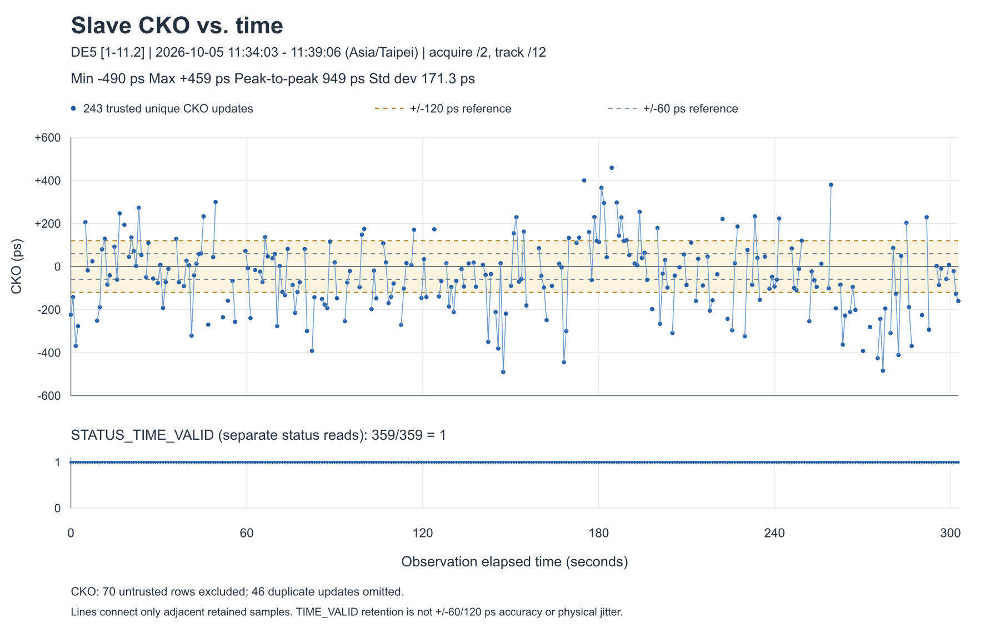
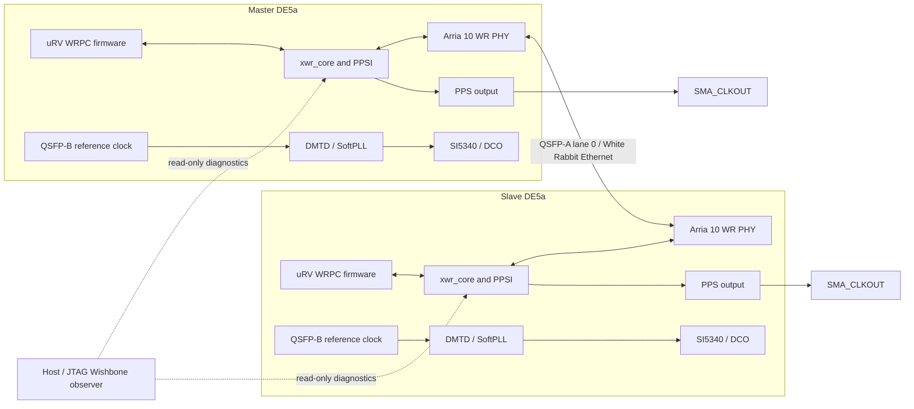

# DE5a White Rabbit — Step7 實體 PPS 同步：階段性驗證

最新紀錄整理日期：**2026-10-07**；分支：`step7-physical-measurement`。

Step6 與 Step7 milestone 現在也已提交完整展開的 **`source/`**，可直接在資料夾內
依序 build → compile → program → dashboard，不必先解壓。
`source/` 為可寫建置工作區，頂層壓縮封存與原始 SOF 維持唯讀。
請參閱 [Step6 編譯方式](artifacts/milestones/step6_global_time/SOURCE_USAGE.md)
或 [Step7 編譯方式](artifacts/milestones/step7_physical_measurement/SOURCE_USAGE.md)。

將 Master 與 Slave 的 SMA PPS 輸出接入 **RIGOL DS1104Z Plus** 示波器後，
可觀察到兩台脈衝的上升緣在**奈秒（ns）等級對齊**。
使用者在本次觀測期間未見明顯漂移；此結果作為 White Rabbit
**實體同步的階段性驗證**，不等同於已完成校準的皮秒（ps）精度認證。


### 輸出訊號：每秒一次、脈寬 10 ms 的 PPS

- 參考時鐘為 **125 MHz**，**Clock Period = 8 ns**。
- PPS 的重複週期為 **1 秒（1 Hz）**，不是 8 ns。
- 脈寬設定為 **10 ms**，對應 **1,250,000 個 8 ns 時鐘週期**，占空比約 1%。
- 兩台 top-level 的 `SMA_CLKOUT` 都連接 WR Core 的 `pps_p_o`；SMA 輸出不是連續的 125 MHz clock。

以上為設定值與原始碼核查；這張 5 ns/div 的局部上升緣截圖本身，
不能驗證完整的 10 ms 脈寬或 1 秒重複週期。

### 示波器觀測結果與量測限制

本次畫面為 **500 MSa/s**，即每 **2 ns** 取得一個樣本；水平刻度為 **5 ns/div**。
CH1 黃色為 Master，CH2 青色為 Slave。畫面中的 CH1→CH2 上升緣延遲統計為：

| 指標 | 示波器顯示值 |
|---|---:|
| 平均延遲 | −86.44 ps（−0.08644 ns） |
| 最小／最大延遲 | −1.700 ns／+1.400 ns |
| 顯示統計的峰對峰範圍 | 3.100 ns |
| 當前延遲 | −600.0 ps（−0.6000 ns） |

圖上標註的 **60 次 pulse** 為使用者提供的統計次數，未附逐筆波形資料。
延遲正負號依示波器 CH1→CH2 的量測定義記錄。

數位示波器取得的是離散採樣點；顯示曲線與邊緣時間估計可能使用插值／重建。
因此，小於 2 ns 的延遲估計並非不可能，但**顯示到 ps 位數不代表具備相同的實際量測準確度**。
估計結果仍受插值方法、100 MHz 類比頻寬、雜訊、邊緣門檻及兩路通道／線材延遲影響。
本圖未記錄所選插值模式，也未提供通道與線材去偏差校準。
儀器頻寬與採樣規格可參閱 [RIGOL 官方 DS1000Z 資料表](https://www.rigol.com/dam/global/downloads/brochures/en/data-sheet/oscilloscopes/DS1000Z_DataSheet_EN.pdf)。

所以，本次支持的是**奈秒等級的實體脈衝對齊**，不是「同步誤差已被證明為 −86.44 ps」。
「未見明顯漂移」是本次使用者的觀察；單張統計截圖無法量化長時間漂移、
抖動分布或重新啟動的可重現性，也不能拿它替代新的 TIME_VALID 300 秒驗證。
此處的示波器通道延遲與韌體 CKO 是不同的量測量，不混為一談。

[完整 Step7 觀測報告](experiments/step7/EXP-S7-PHYSICAL-PPS-SMA-OBSERVATION-20261007/REPORT.md)
· [唯讀 Step7 milestone：程式碼、腳本、儀表板與 SOF](artifacts/milestones/step7_physical_measurement/README.md)

目前可編輯主程式保留 Step7 的 Slave bootstrap=512、Master bootstrap=2048，
WR 相位取得 `/2`、追蹤 `/12`，60/120 ps 門檻不變。
本次只整理使用者量測與封存，沒有修改控制程式、重新燒錄或合併 main。
現有 SOF 建置來源為 `4d7e38189e26707afffb2ecc404f3ad0e8a08326`；
本次截圖未附量測當時的 loaded-image 識別紀錄，故不把它當成 exact-image 重現證明。

## 歷史 Step6：TIME_VALID 維持 300 秒（原拓樸，2026-10-05）

歷史實機驗證：**2026-10-05，切入 Step7 前的 Pain 主程式既有運行狀態**。
Master 在 **302.874 秒**內有 **1190/1190** 筆有效採樣；Slave 在
**302.667 秒**內有 **359/359** 筆有效採樣。兩台分別通過原有的
TIME_VALID 300 秒採樣門檻，無無效採樣或讀取錯誤。
Slave 的五項 PLL 鎖定信號在 359/359 筆讀取中皆為 1，採樣中的重置資訊也未改變。
兩台是依序觀測，並非同時量測。

## Slave CKO 隨時間變化



觀測時間：2026-10-05 **11:34:03–11:39:06，臺北時間（Asia/Taipei）**。
橫軸為開始觀測後經過的秒數，縱軸為 CKO，單位是皮秒（ps）。
243 筆可信且不重複的更新介於 **−490～+459 ps**，峰對峰為
**949 ps（0.949 ns）**，中位數 **−44 ps**，標準差 **171.3 ps**。
已排除 70 筆不可信的相位資料與 46 筆重複更新；折線不跨越被排除的採樣。
下方獨立面板保留全部 359 筆原始 TIME_VALID 狀態讀取。

**TIME_VALID 維持門檻已通過；尚未證明 offset 能長時間維持在 ±60/120 ps。**
CKO 是 WR 時間戳記／伺服控制的診斷值，不是實體振盪器抖動或 SMA/PPS 邊緣時間差的量測。
冷啟動可重現性與時序收斂仍是獨立限制；時序收斂不是本次通過門檻。

[完整觀測報告](experiments/step6/EXP-S6-LIVE-TIME-VALID-CKO-300S-PROMOTION-20261005/REPORT.md)
· [CSV](experiments/step6/EXP-S6-LIVE-TIME-VALID-CKO-300S-PROMOTION-20261005/analysis/cko-timeseries.csv)
· [SVG](experiments/step6/EXP-S6-LIVE-TIME-VALID-CKO-300S-PROMOTION-20261005/analysis/cko-timeseries.svg)
· [原始觀測紀錄](experiments/step6/EXP-S6-LIVE-TIME-VALID-CKO-300S-PROMOTION-20261005/raw/observe/cko-303s.log)

## 主程式：建置 → 編譯 → 燒錄 → 開啟儀表板

```sh
cd /home/b10504072/04_WR
bash scripts/build/build_current.sh
bash scripts/build/compile_current.sh
bash scripts/program/program_current.sh
bash scripts/monitor/step1_6_dashboard.sh
```

前一步成功後才執行下一步；燒錄前請停止其他 JTAG 讀取程序。
新 SOF 存放於 `output/DE5a_wr_master_jtag.sof` 與 `output/DE5a_wr_slave_jtag.sof`。
保留原本可編輯的操作流程，不加入 SHA 驗收檢查。
實際 WR 控制參數為相位取得 `/2`、追蹤 `/12`，狀態切換門檻維持 60/120 ps。
歷史「不校正」實驗的資料夾名稱，不代表目前載入的韌體模式。

本歷史 Step6 觀測的產物來自 `bcb84305`，紀錄整理於 `9b8a231c`；不是目前 Step7 的 SOF。
本次只觀測既有運行狀態，未重新建置、燒錄、重置、斷電、修改控制參數，
也未變更唯讀 Step6 milestone 或封存資料夾。
本次證據驗證的是這次運行狀態，不保證每次未來啟動都會成功。
儀表板 Step5 的 `INFO/LOCK_ACQUIRED_NOT_STABLE` 是短觀測窗的顯示結果，
不會推翻上述 359 筆長時間鎖定觀測。

## 歷史紀錄：僅還原 milestone 原始碼（2026-10-04）

The production code has been restored to the read-only
`artifacts/milestones/step6_global_time/source.tar.gz` contents.
WR phase correction is active again: initialization is restored, acquisition
uses `/2`, tracking uses `/12`, and the 60/120ps state gates are unchanged.
The sealed milestone and protected Pain archive were not modified.

Scripts were NOT restored from the milestone. The existing editable workflow
is retained, without SHA acceptance checks. From Pain's main folder, use the
same four commands, in order, to generate and deploy NEW root products:

```sh
cd /home/b10504072/04_WR
bash scripts/build/build_current.sh
bash scripts/build/compile_current.sh
bash scripts/program/program_current.sh
bash scripts/monitor/step1_6_dashboard.sh
```

Stop any dashboard/JTAG reader before programming. This restoration does not
compile, program, replace existing SOFs, or establish a new TIME_VALID300s PASS.
The milestone records historical sampled300s success but also a failed fresh
standalone acquisition; identical source is not a guarantee of lock on every boot.
Extra historical diagnostics and experiment records remain preserved and are
not part of the current four-step workflow. The no-correction observer and its
source tests describe the previous diagnostic, not this active controller.
The unchanged script configuration still uses the previous diagnostic's log
directory name; that label does not identify the loaded firmware. See the
[restoration record](experiments/step6/EXP-S6-MAIN-RESTORE-SEALED-MILESTONE-SOURCE-20261004/REPORT.md).

## Previous diagnostic: WR phase correction OFF (2026-10-04)

The previous diagnostic set `WRH_PHASE_CORRECTION_ENABLED=0`: no WR phase-setpoint
arithmetic/write from initialization, acquisition or tracking. This is the safe
meaning of requested "/0+/0", NOT division by zero. The /2+/12 reference branch
and60/120ps gates remain, but the phase correction branch is compiled out.
CKO measurements remain live; SoftPLL and coarse time synchronization still
operate. This is not a physical oscillator-jitter measurement or a Step6 PASS.
Set the source mode default to1 to restore /2+/12, then rebuild/program.
Code-only preparation; existing SOFs/hardware have NOT been updated by us.
See the [diagnostic plan](experiments/step6/EXP-S6-WRH-NO-PHASE-CORRECTION-CKO-OBSERVATION-20261004/PLAN.md).
After any source edit, run from Pain's main folder:

```sh
cd /home/b10504072/04_WR
bash scripts/run_current.sh
```

Optionally wait15minutes after successful programming before showing the
dashboard:

```sh
POST_PROGRAM_WAIT_S=900 bash scripts/run_current.sh
```

The four separate commands remain `scripts/build/build_current.sh`,
`scripts/build/compile_current.sh`, `scripts/program/program_current.sh`,
`scripts/monitor/step1_6_dashboard.sh` (each with `bash`). New SOFs are in
`output/DE5a_wr_master_jtag.sof` and `output/DE5a_wr_slave_jtag.sof`.
Editable main workflow does not require fixed SHA values, a clean Git tree or
SHA verification. Hashes are generated only as experiment records. Build errors,
missing outputs and competing JTAG sessions still stop the pipeline. Stop the
dashboard before running another reader/programmer. Frozen milestones unchanged.

After a successful fresh build/program, stop the dashboard and optionally run
`bash scripts/monitor/observe_cko_no_correction.sh` for303s of guarded Slave
CKO data and a min/max/peak-to-peak summary, saved in the current experiment.
It does not build/program/reset or force validity; it cannot identify loaded
firmware independently. Results require actual hardware observation.

## Previous requested restoration — source-only

The previous /2+/12 restoration was synchronized but not rebuilt/programmed by
the assistant, at the user's request. Its plan is retained
[here](experiments/step6/EXP-S6-WRH-RESTORE-ACQ2-TRACK12-TIME-VALID-20261004/PLAN.md).

## Previous /24+/24 candidate — negative result preserved

See [the previous candidate plan](experiments/step6/EXP-S6-WRH-ACQ24-TRACK24-15MIN-SETTLING-20261004/PLAN.md).
Actual fresh build/program and15-minute settling completed. Slave remained
TIME_VALID0; later250 trusted new updates over301797ms had CKO−2085..+2986ps,
zero inside±120ps, all five PLL locks1. **This /24+/24 candidate is NOT a
TIME_VALID300s PASS.** The retained Git outputs are those /24 SOFs from`6eb0c2c1`,
not the new diagnostic implementation; Pain may have separate user builds.
Use the full pipeline before programming this candidate. See the
[completed experiment report](experiments/step6/EXP-S6-WRH-ACQ24-TRACK24-15MIN-SETTLING-20261004/REPORT.md).

# Previous target: TIME_VALID 300s — same-image failure preserved

The previous fresh root replay reproduced an acquisition failure despite identical
FPGA configuration: all five Slave PLL locks1, Main231/231 valid frames and
230 progressing intervals, but TIME_VALID0 in789 accepted rows across the
600s acquisition window. Actual Slave phase current/target later5312/5312ps;
final CKO−2317ps in WAIT. This is not a missing Main-update stream or proof
of a continuously stuck shifter. That run's `output/` contained the actual
compile from `640436ca`, not a newly qualified300s image. Calibration/runtime
phases differ under equal RBFs; their causal significance remains unresolved.
See the [latest preserved-failure report](experiments/step6/EXP-S6-SAME-IMAGE-MAIN-PHASE-READBACK-STARTUP-20261004/REPORT.md).
Canonical milestones/archive remain unchanged. The earlier success below
is historical evidence, not the current boot's result.

## Previous identical-image replay: successful, not deterministic startup

Fresh **main-root** build/compile/program and sampled300s verification passed
again on both boards: Master/Slave1190/1190 valid rows over302852/302870ms.
That run's `output/` contained the actual build from `3bf9f3b4`, not a new control
candidate. All3117 production inputs/MIFs are unchanged; FPGA RBF payloads
match both the qualified root and the earlier failed standalone boot exactly.
The startup trace first observed TIME_VALID after159381ms of observer time.
**Deterministic initial acquisition is NOT_ESTABLISHED.** Current TIME_VALID
PASS does not imply±120ps accuracy; final CKO was−1987ps with validity still1.
See the [latest acquisition/retention diagnosis](experiments/step6/EXP-S6-IDENTICAL-IMAGE-STARTUP-ACQUISITION-ATTRIBUTION-20261004/REPORT.md).
Milestones and protected archive were not changed in this diagnosis.

## Qualified baseline and independent milestone-reproduction limitation

Active main-root candidate: `EXP-S6-MAIN-ROOT-TIME-VALID-300S-BACKTRACK-20261003`.
The user resumed with the TIME_VALID-only criterion. The 3110 qualified
production inputs from `0bb02c6f` are restored in the main root; frozen
milestones/archive were untouched during the root run. A NEW root
build/program/capture completed: **TIME_VALID300s PASS on both boards**.
Master1191/1191 over302747ms; Slave1190/1190 over302799ms, zero invalid rows.
Historical WR validity behavior is
used, not the superseded strict full64 offset revocation. This does not prove
offset within +/-120ps, absolute-time accuracy or physical PPS skew.

Use the same four main-root scripts: `build_current.sh`, `compile_current.sh`,
`program_current.sh`, then `step1_6_dashboard.sh`, in their existing `scripts/`
subdirectories. Stop any dashboard before another JTAG reader. Qualification
uses `scripts/monitor/verify_time_valid_300s.sh`, not one dashboard frame.
See the [current plan](experiments/step6/EXP-S6-MAIN-ROOT-TIME-VALID-300S-BACKTRACK-20261003/PLAN.md).
See the [completed root report](experiments/step6/EXP-S6-MAIN-ROOT-TIME-VALID-300S-BACKTRACK-20261003/REPORT.md).
Canonical Step6 contains this qualified root version only. The new independent
build/program succeeded, but two600s same-session waits never acquired Slave
TIME_VALID: **fresh standalone300s reproduction NOT ESTABLISHED**. Root/fresh
RBF configurations match byte-for-byte; do not promise identical acquisition
on every boot. Unqualified products are preserved outside the canonical package.
See the [milestone reproduction report](experiments/step6/EXP-S6-MILESTONE-MAIN-ROOT-TIME-VALID-300S-REPRO-20261003/REPORT.md).
The strict-offset research below is historical context, not this round's gate.

# DE5a White Rabbit

This repository develops and records the two-board White Rabbit system on Terasic DE5a / Arria 10. The only intended current hardware workflow is the JTAG-based Master/Slave design; frozen milestone snapshots preserve each validated research checkpoint.

## Historical strict-offset research (superseded criterion/products)

**Historical strict WR validity candidate, NOT QUALIFIED.**
Historical experiment: `EXP-S6-MASTER-RXTS-CALIBRATION-ROLE-EXCHANGE-20261003`.
Prepared bounded same-gateware role exchange and passive calibration-status
query. Native tests/build/program/hardware calibration pending; no guessed
T24P and no gain/strict-gate changes. Output still contains the preceding
diagnostic products until a real new compile. See the
[current plan](experiments/step6/EXP-S6-MASTER-RXTS-CALIBRATION-ROLE-EXCHANGE-20261003/PLAN.md).
Preceding completed experiment: `EXP-S6-NEAREST-MAIN-TIMESTAMP-EXACT-JOIN-20261003`.
Completed passive exact accepted-update join; native/firmware tests, fresh
two-board full compile and one Slave→Master programming pair passed from
`1ab27d25c6935ed5e6ddb5af129982f66a2265ac`. Root output contains THESE
actual diagnostic SOFs, not a strict PASS milestone. Production inputs/MIFs
unchanged; observer correction8b7e211b required no reprogram.16 exact common
updates, Main15/15 progress,58876 updates; four action-free CKO~4ns steps
correspond to return~8ns changes. Post-accept Main error−239..+183ps is not
packet-time atomic. Strict startup/acquisition/postflight:0fresh<60 entries,
0ms qualified hold; no300s extension. Next boundary is Master RX coarse/fine
continuity and calibration provenance, not an automatic Ki sweep. See the
[completed report](experiments/step6/EXP-S6-NEAREST-MAIN-TIMESTAMP-EXACT-JOIN-20261003/REPORT.md).
Same-boot follow-up:16 exact Master RX→Slave T4 pairs isolate one8.54ns
return change to fine linearization with constant coarse return. That step
follows a WR action, not action-free. Master T24P remains unmeasured2389ps;
next is bounded same-gateware calibration, not a guessed value. See the
[follow-up](experiments/step6/EXP-S6-NEAREST-MAIN-TIMESTAMP-EXACT-JOIN-20261003/SAME_BOOT_FOLLOWUP.md).
See the [current plan](experiments/step6/EXP-S6-NEAREST-MAIN-TIMESTAMP-EXACT-JOIN-20261003/PLAN.md).
Preceding completed experiment: `EXP-S6-MAIN-NEAREST-STEP-ADMISSION-20261003`.
Fresh two-board compile/one Slave-to-Master programming pair completed from
`a45da74188d9ae325ac1c176bde74920018c0be4`; those nearest-admission SOFs
are superseded by the paired diagnostic products above, not erased.
Slave admission8(up)/9(down), consistent midpoint tie; completion still16.
Master, Helper, firmware/Kp600/Ki1, strict60/120 and observers unchanged.
Native/source/firmware tests passed.60 coherent snapshots:59/59 Main progress,
9526 completions, residual-11..+11, CKO-254..+143ps. Strict acquisition/postflight
qualified spans3187/607ms; no300s extension. Final Slave invalid/CKO104ps means
WAIT after an excursion, not a false validity claim. See the
[completed report](experiments/step6/EXP-S6-MAIN-NEAREST-STEP-ADMISSION-20261003/REPORT.md),
[current plan](experiments/step6/EXP-S6-MAIN-NEAREST-STEP-ADMISSION-20261003/PLAN.md)
and [build precheck](experiments/step6/EXP-S6-MAIN-NEAREST-STEP-ADMISSION-20261003/BUILD_PRECHECK.md).
Preceding experiment: `EXP-S6-MAIN-DCO-APPLICATION-CORRELATION-20261003`.
Fresh native equivalence/full compiles/one programming pair completed from
`f0f0f7ef14b4e1a139f80e1ce131ecaa042575f1`; these passive-capture products
are superseded, not erased. Firmware/control unchanged from Kp600.
Final observer source70193e25 corrects session ownership, actual Quartus
instance tuples and independent seven-read publication groups without reprogram.
60 coherent snapshots: Main progress59/59,641 completions, latency1.22882ms;
59/60 residuals below16 code, but CKO-201..+227ps. Strict acquisition/postflight
qualified spans604/0ms, no300s extension. Final TIME_VALID1/CKO-55ps is pointwise.
See the [DCO correlation report](experiments/step6/EXP-S6-MAIN-DCO-APPLICATION-CORRELATION-20261003/REPORT.md).
Nearest-admission testing above did not establish stable WR offset. Next
boundary is coherent Main phase/tracker versus timestamp provenance, not an
automatic Ki/gain sweep; physical step and strict60/120 stay unchanged.
The preceding Kp600 products below are superseded; evidence is not erased.
Previous experiment: `EXP-S6-MAIN-KP600-STRICT-OFFSET-HOLD-20261003`.
Previous native tests/full compiles/one programming pair completed from
`78948729bc18c5a78aaede3b6a8f7a363042efc7`; those products are now superseded,
not a strict PASS image. The sole functional change was
Slave shared Main Kp300→600; Ki1 and all thresholds remain fixed. Master MIF
is identical; Slave binary changed only two instruction bytes. Main phase
error narrowed to−198..+229ps, but WR CKO remains−301..+274ps. The120s
acquisition/postflight longest qualified holds were2109/901ms; no300s extension.
Final TIME_VALID1/CKO−105ps is pointwise only. See the
[Kp600 report](experiments/step6/EXP-S6-MAIN-KP600-STRICT-OFFSET-HOLD-20261003/REPORT.md).
The previous phase/progress round completed from25603ae2; its products are
superseded, not erased. Main/tracker progressed31/31 intervals; Main error
−411..+502ps and WR CKO−307..+242ps, qualified holds603/605ms. See the
[phase/progress report](experiments/step6/EXP-S6-MAIN-PHASE-PTRACKER-PROGRESS-CORRELATION-20261003/REPORT.md).
The preceding paired provenance experiment is retained below for comparison;
its SOFs are superseded, its evidence is not erased.
That preceding observer-only round completed native tests, two full compiles and one
Slave→Master programming pair from
`31bfaeb55f667719dbcc8690139f859598683ed4`. Its diagnostic SOFs are now superseded,
not a strict PASS milestone. In that paired round, production inputs and MIF
pins are unchanged. All32 Master/16 Slave records validated;14accepted T4
values exactly matched Master RX, with13consecutive differences. The~4ns jump
was not reproduced in this snapshot, but action-free CKO still moved~926ps.
The120s startup had9fresh<60ps entries and only1501ms qualified hold;
postflight failed the extension gate. See the
[paired report](experiments/step6/EXP-S6-MASTER-RX-TO-SLAVE-T4-PAIRED-PROVENANCE-20261003/REPORT.md).
Current source restores normal /2 acquisition + /12 tracking and adds a passive
same-update four-timestamp/RTT RAM history. Fresh two-board build/program from
`4e0c2324095c8644dac7fb5426f69de0eadb392c` completed in the preceding round;
its diagnostic products are now superseded by the paired round. All16consecutive
timestamp records passed identities. Action-free ~8.2ns return-leg jumps
correspond to ~4.2ns CKO jumps. The120s acquisition observation reached<60ps,
but qualified hold was only2102ms; postflight did not satisfy the extension
gate. See the [completed report](experiments/step6/EXP-S6-COHERENT-FOUR-TIMESTAMP-RTT-DIAGNOSTIC-20261003/REPORT.md).
The preceding completed fixed-setpoint diagnostic had fresh
two-board builds and one Slave→Master programming pair succeeded from
`fbd8febf3eab38e6d2734f859d911f1e6b10365f`; those products are now superseded.
In that previous diagnostic, first strict entry froze WR setpoint, but >120ps
still revoked Slave time, without automatic re-enable in that boot. This was NOT
a production PASS image. Late-entry read-only capture found CKO/DMS jumps near
4ns with unchanged WR phase-write/init counts and SETP; 38 fresh updates did
not meet the preset 40-update diagnostic gate. Strict 300s remains
NOT_ESTABLISHED, diagnostic INCONCLUSIVE. See the
[report](experiments/step6/EXP-S6-FIRST-ENTRY-FIXED-SETP-STRICT-VALIDITY-20261003/REPORT.md).
Preceding source added passive packet-specific timestamp RAM snapshots;
both fresh compiles/programming completed from
`13d5c99b2b1898cf9cd9d9864288f7f9d5cccccf`, now superseded by the fixed-SETP build.
The90s preflight reached <60ps with a2669ms qualified span, not300s. Packet
math validated, but fine stability remains NOT_ESTABLISHED; see the
[RXTS report](experiments/step6/EXP-S6-RXTS-RAW-AHEAD-PHASE-DIAGNOSTIC-20261003/REPORT.md).
The then-requested strict gate also required a <60 ps acquisition and a 300 s interval
within +/-120 ps, with Slave validity revoked on excursions. The old
TIME_VALID-only pass does not prove this. The preceding role-corrected candidate
was compiled from `4ba9df5935fc0a6afae2c7bd29603f190936e627`
and programmed on 2026-10-02. Master validity was restored; its completed660s
strict capture had no <60 ps entry, CKO -3158..+3839 ps, and no qualified hold.
Slave correctly remained invalid. These are NOT PASS
milestone images. Any further production-source change still requires rebuild.

**Historical Step6 TIME_VALID-only PASS — two root cycles (2026-10-02).**
Historical experiment: `EXP-S6-MASTER-HPLL-STEP64-REPEATABILITY-20261002`.
Each cycle freshly built firmware, fully compiled both FPGA projects, programmed
Slave then Master, and sampled each board for more than 300 seconds.
All four windows had 1192/1192 TIME_VALID rows; no invalid rows or transport
errors. The two cycles used identical 3110 production inputs and firmware MIFs.
See the [qualification report](experiments/step6/EXP-S6-MASTER-HPLL-STEP64-REPEATABILITY-20261002/REPORT.md).
The frozen Step6 package also passed a new full independent-directory
build/compile/program reproduction: Master/Slave 1192/1192 valid rows over
302952/302872 ms. See the [standalone rebuild report](experiments/step6/EXP-S6-MILESTONE-STANDALONE-FRESH-REBUILD-TIME-VALID-300S-20261002/REPORT.md).

The production change is Master `HPLL_TRACKER_CODE_PER_PHYSICAL_STEP` 34 → 64;
Master bootstrap remains 2048, Slave control remains `/2 acquisition + /12 tracking`.
Master Helper was locked and its phase tracker ready after qualification.
The earlier byte-identical bootstrap2048 archive failed after reprogramming:
copy equality alone was not reproduction evidence. That failure is retained
in the new report, not hidden by this PASS.

The [single Step6 milestone](artifacts/milestones/step6_global_time/README.md)
contains the qualified source, all scripts/dashboard, products and evidence.
Run `prepare_source.sh` there and use its independent `source/` directory.
Only `artifacts/milestones/` holds frozen operational snapshots;
`experiments/` holds evidence, not a different current build entrypoint.
This is the user's sampled TIME_VALID-only gate. Sequential board reads do
not establish physical time accuracy, cycle-by-cycle continuity, offset <60 ps,
or universal startup reliability. Timing closure is not required.

## Current four-step workflow

Run on Pain from `/home/b10504072/04_WR`:

```sh
bash scripts/build/build_current.sh          # 1. build firmware
bash scripts/build/compile_current.sh        # 2. compile both FPGA images
bash scripts/program/program_current.sh      # 3. program Slave, then Master
bash scripts/monitor/step1_6_dashboard.sh      # 4. live read-only dashboard
```

The retained images are `output/DE5a_wr_master_jtag.sof` and `output/DE5a_wr_slave_jtag.sof`, with build metadata and checksums. Firmware binaries/MIF and compile reports are retained in `build/`. Stop the dashboard before running any verifier. `bash scripts/monitor/verify_time_valid_300s.sh` checks the CURRENT sampled TIME_VALID-only gate. `verify_strict_offset_time_valid_300s.sh` remains for the superseded precision research; neither the dashboard nor the bit-only verifier establishes that stricter accuracy criterion. Timing closure is not a gate. Do not reprogram a failing live boot before preserving acquisition evidence.

Firmware version text stays pinned for reproducibility; the passive diagnostic changes the MIF and has separately pinned hashes. `output/SOURCE_COMMIT` records the real checkout used for compilation. Until the new compile/export finishes, retained `output/` files still belong to the preceding build; the source-manifest gate prevents programming those stale files as the new source.

## System architecture


```mermaid
flowchart LR
  subgraph M[Master DE5a]
    MCPU[uRV WRPC firmware] <--> MCORE[xwr_core and PPSI]
    MCORE <--> MPHYS[Arria 10 WR PHY]
    MREF[QSFP-B reference clock] --> MDMTD[DMTD / SoftPLL]
    MDMTD --> MDCO[SI5340 / DCO]
    MCORE --> MPPS[PPS output]
  end
  subgraph S[Slave DE5a]
    SCPU[uRV WRPC firmware] <--> SCORE[xwr_core and PPSI]
    SCORE <--> SPHYS[Arria 10 WR PHY]
    SREF[QSFP-B reference clock] --> SDMTD[DMTD / SoftPLL]
    SDMTD --> SDCO[SI5340 / DCO]
    SCORE --> SPPS[PPS output]
  end
  MPHYS <-->|QSFP-A lane 0 / White Rabbit Ethernet| SPHYS
  JTAG[Host / JTAG Wishbone observer] -. read-only diagnostics .-> MCORE
  JTAG -. read-only diagnostics .-> SCORE
  MPPS --> MSMA[SMA_CLKOUT]
  SPPS --> SSMA[SMA_CLKOUT]
```

The diagram is a functional overview, not a pin-level schematic. Each board runs the White Rabbit core and WRPC firmware; the Master and Slave roles use unique endpoint identities. QSFP-A lane 0 is the fixed inter-board WR Ethernet data path. The local reference clock feeds DMTD; SoftPLL uses DMTD phase measurements to control the SI5340-based DCO. The WR core's PPS output is routed to `SMA_CLKOUT`. A healthy PHY/link indication alone does not prove valid PTP time, PPS, SoftPLL lock, or global-time agreement.

The current design uses the Arria 10 White Rabbit PHY and its required generated IP inputs. Master and Slave are separate JTAG Quartus projects with the top-level entities shown below. On Pain, the board cables are `DE5 [1-11.1]` for Master and `DE5 [1-11.2]` for Slave. Runtime status and Wishbone-register observation use the JTAG scripts under `scripts/jtag/`; the Step 1–6 dashboard is read-only.

The RS422-named pins in the JTAG top-level are retained only as the board's
WRPC physical-UART console sideband. They do not define a second White Rabbit
architecture or a build/program/diagnostic workflow; all current FPGA project
builds/programming and all milestone acceptance/diagnostic observations use
JTAG. The UART sideband may be used only as the WRPC text console.

Canonical Quartus top-level entities:

```text
DE5a_wr_master_jtag
DE5a_wr_slave_jtag
```

## Current milestone status

Steps 1–5 retain independently validated frozen checkpoints. The single Step6
package is now the Master-step64 version qualified by two fresh complete root
cycles. Current images are in `output/`. Earlier common-PPS/digital-trigger
results remain in their experiment reports, not as a second Step6 package.
See [STATUS.md](STATUS.md) and [MILESTONES.md](MILESTONES.md).

## Reproduce the validated Step 2 checkpoint

Quartus Prime Standard Edition 17.0.0 Build 595 and the RISC-V firmware toolchain are used by the validated milestone. On Pain, set the Quartus executables and toolchain `PATH`, then run from the repository root:

```sh
cd artifacts/milestones/step2_endpoint_ptp/source
bash scripts/build/build_master.sh
bash scripts/build/build_slave.sh
CABLE='DE5 [1-11.1]' bash scripts/program/program_master.sh
CABLE='DE5 [1-11.2]' bash scripts/program/program_slave.sh
```

The programming wrappers use the freshly built JTAG images in that frozen source directory. The validated order for this Step 2 reproduction was Master then Slave. Build success alone is not runtime validation; use the acceptance procedure in the milestone README and experiment report.

## Reproduce the validated Step 3 checkpoint

The exact Step 3 SOF files programmed and validated on 2026-09-24 are:

- Master: [`artifacts/milestones/step3_wr_handshake/master.sof`](artifacts/milestones/step3_wr_handshake/master.sof)
- Slave: [`artifacts/milestones/step3_wr_handshake/slave.sof`](artifacts/milestones/step3_wr_handshake/slave.sof)

On Pain, the independent build outputs are under
`artifacts/milestones/step3_wr_handshake/source/quartus/output_files_master_jtag/DE5a_wr_master_jtag.sof`
and
`artifacts/milestones/step3_wr_handshake/source/quartus/output_files_slave_jtag/DE5a_wr_slave_jtag.sof`.
Their SHA-256 hashes match the two files above. Program Master first, then
Slave, using the wrappers in
`artifacts/milestones/step3_wr_handshake/source/scripts/program/`. See the
[Step 3 milestone README](artifacts/milestones/step3_wr_handshake/README.md)
for the exact verification boundary and limitations.

## Reproduce the validated Step 4 SoftPLL-startup checkpoint

The exact Step 4 SOFs rebuilt from the frozen source and programmed on
2026-09-24 are:

- Master: [`artifacts/milestones/step4_softpll_startup/master.sof`](artifacts/milestones/step4_softpll_startup/master.sof)
- Slave: [`artifacts/milestones/step4_softpll_startup/slave.sof`](artifacts/milestones/step4_softpll_startup/slave.sof)

Their SHA-256 hashes are recorded in the milestone `SHA256SUMS` and
`MILESTONES.md`. The independent source snapshot is
`artifacts/milestones/step4_softpll_startup/source/`. Rebuild both projects
from that directory with the wrappers documented in its README. The validated
programming order was Master, wait approximately 45 seconds, then Slave. Use
the acceptance procedure and known limitations in the
[Step 4 milestone README](artifacts/milestones/step4_softpll_startup/README.md)
and the
[Step 4 reproduction report](experiments/step4/EXP-S4-MILESTONE-REPRO-20260924/REPORT.md).

## Reproduce the validated Step 5 full-lock checkpoint

The exact Step 5 SOFs rebuilt and validated on 2026-09-24 are:

- Master: [artifacts/milestones/step5_softpll_lock/master.sof](artifacts/milestones/step5_softpll_lock/master.sof), SHA-256 f72501285cef7f6a892b9334e7de93a5a86f8aff7311417f577c14acfd213a30.
- Slave: [artifacts/milestones/step5_softpll_lock/slave.sof](artifacts/milestones/step5_softpll_lock/slave.sof), SHA-256 d4efd77c91ddc96cd6444e3f47cadf529a4f19da4c9f6b0876ce00557d63ca20.

The independent frozen build source is artifacts/milestones/step5_softpll_lock/source/. On Pain, with the recorded Quartus and RISC-V toolchains on PATH:

```sh
cd artifacts/milestones/step5_softpll_lock/source
bash scripts/build/build_firmware.sh master
bash scripts/build/build_master.sh
bash scripts/build/build_firmware.sh slave
bash scripts/build/build_slave.sh
CABLE='DE5 [1-11.1]' bash scripts/program/program_master.sh
CABLE='DE5 [1-11.2]' bash scripts/program/program_slave.sh
```

The validated program order was Master, wait at least 90 seconds, then Slave; wait at least 120 seconds after both before read-only preflight. The 300-second F4L invocation and full acceptance evidence are in the [Step 5 reproduction report](experiments/step5/EXP-S5-MILESTONE-REPRO-20260924/REPORT.md). The [Step 5 milestone README](artifacts/milestones/step5_softpll_lock/README.md) records the exact acceptance boundary and caveats.

## Reproduce the validated Step 6 TIME_VALID checkpoint

The current Step 6 research index, including successful and failed runs, is
[`experiments/step6/README.md`](experiments/step6/README.md).

The exact second-cycle Step6 SOFs compiled and programmed on 2026-10-02 are:

- Master: [master.sof](artifacts/milestones/step6_global_time/master.sof), SHA-256 `9f66cef3f06697085325916126e6da61d76ace7138e7203af068df1a69d30036`.
- Slave: [slave.sof](artifacts/milestones/step6_global_time/slave.sof), SHA-256 `b92e3356580691814e113e8c3278f1044bee621e2808d207541c9efc3ba59727`.

On Pain, prepare the standalone source and then use its original scripts:

```sh
cd artifacts/milestones/step6_global_time
bash prepare_source.sh
cd source
bash scripts/build/build_current.sh
bash scripts/build/compile_current.sh
bash scripts/program/program_current.sh
bash scripts/monitor/step1_6_dashboard.sh
```

To program the frozen milestone SOFs, from the same `source/` directory use
Slave first, then Master:

```sh
SOF=../slave.sof CABLE='DE5 [1-11.2]' bash scripts/program/program_slave.sh
SOF=../master.sof CABLE='DE5 [1-11.1]' bash scripts/program/program_master.sh
```

Stop the dashboard before running `bash scripts/monitor/verify_time_valid_300s.sh`.
The [milestone README](artifacts/milestones/step6_global_time/README.md) documents
retained-image programming without rebuilding, checksums and external tools.
Historical digital-trigger evidence remains in its experiment reports;
physical SMA skew is not claimed by this TIME_VALID qualification.

## Current development source, build, and programming

The canonical JTAG projects are flattened directly under `quartus/`. The
Quartus-generated PHY/IP inputs required by the build are under
`quartus_generated/`, and the SI5340 controller RTL is under
`quartus/si5340_controller/`. Current development uses only
`DE5a_wr_master_jtag` and `DE5a_wr_slave_jtag`. The RS422 UART sideband is not
an alternate project or management path; the QSFP-B reference-clock input is
not the inter-board White Rabbit packet link.

Use Quartus Prime Standard Edition 17.0.0 Build 595 and the RISC-V firmware
toolchain recorded in the experiment provenance. From the repository root on
Pain, use the pinned current-root wrappers to build firmware and clean-compile
both canonical Quartus projects (including retained-output export):

```sh
bash scripts/build/build_current.sh
bash scripts/build/compile_current.sh
```

`QUARTUS_BIN` may be set to the installed Quartus `bin` directory; the default
is `/mnt/ds1515/opt/intelFPGA/17.0/quartus/bin`. Then program the matching JTAG
images with source/MIF/SOF checks and the current experiment's programming order:

```sh
bash scripts/program/program_current.sh
```

The freshly built current-development SOFs are:

```text
Master: output/DE5a_wr_master_jtag.sof
Slave:  output/DE5a_wr_slave_jtag.sof
```

These are not frozen milestone binaries. For a validated checkpoint, use the
paired SOFs in `artifacts/milestones/stepX_*/` and the matching independent
source snapshot under that directory's `source/`. For example, the Step 3
handshake pair is `artifacts/milestones/step3_wr_handshake/master.sof` and
`slave.sof`.

Run the live, read-only dashboard from the repository root with
`bash scripts/monitor/step1_6_dashboard.sh`. It samples every 10 seconds by
default. `WAIT_FOR_GLOBAL_TIME_SECONDS` is an optional maximum wait for all
visible boards to satisfy the Step 1 and Step 6 gates; it is not a required
fixed delay. Its default is `0`, so a live dashboard displays the current
state immediately. A value such as `120` is a host-side maximum selected by
the caller—not an FPGA timeout and not a mandatory 120-second delay. If that
maximum expires, the result is `INCOMPLETE`, not a hardware-failure verdict;
the dashboard still prints the latest state. Continuous monitoring always
shows each sample immediately and ignores this optional wait; use `ONCE=1`
when deliberately requesting a one-shot readiness gate. On an invalid Slave
Global-Time gate, the panel also shows the WR PTP servo state and signed phase
offset. In `WAIT_OFFSET_STABLE`, the firmware withholds timing output until
the offset is below its source-defined 60 ps threshold; that is how firmware
first asserts TIME_VALID. The historical frozen milestone checked a300-second
TIME_VALID-only hold. The CURRENT root instead requires fresh strict<60ps
acquisition, then inclusive+/-120ps retention with live invalidation outside
that band, plus300seconds of qualified fresh offset/time/Master-health samples.
The exported status bit or dashboard alone cannot establish this stricter gate.

## Source and evidence policy

- Current development source is `quartus/`, `quartus_generated/`,
  `firmware/`, `vendor/`, and `scripts/`.
- `artifacts/milestones/stepX_*/source/` is frozen, self-contained historical
  source. Do not edit it for ordinary development.
- `experiments/stepX/EXP-.../` stores experiment plans, raw build/program
  evidence, runtime captures, analysis, reports, and checksums.
- `experiments/legacy/` retains imported historical reports under their
  original group layout; they are evidence, not current design instructions.
- A milestone is PASS only after its own frozen source is clean-built,
  programmed on both DE5a boards, and passes that step's runtime criteria.
  Never use a later-step SOF to stand in for an earlier checkpoint.
- Record historical and rebuilt SOF hashes separately. Build success alone is
  not runtime validation; report timing closure separately from functional
  status.

Repository directories:

| Path | Purpose |
|---|---|
| `quartus/` | Current Master/Slave JTAG projects and project-owned RTL. |
| `quartus_generated/` | Version-controlled Quartus/Qsys generated PHY/IP build inputs. |
| `firmware/` | Master/Slave WRPC firmware configuration and build scripts. |
| `vendor/` | Pinned White Rabbit RTL and firmware dependencies. |
| `scripts/` | Build, program, JTAG, monitoring, analysis, and test tools. |
| `experiments/` | Step-indexed research records and raw evidence. |
| `artifacts/milestones/` | Frozen, independently reproducible step checkpoints. |

Every milestone has its own source snapshot and is marked PASS only after that snapshot is clean-built, programmed on both DE5a boards, and passes its own runtime acceptance criteria. Never use a later-Step SOF to stand in for an earlier milestone. Historical SOF hash mismatches are recorded, not hidden. Timing closure is reported separately and is not silently inferred from functional PASS.

See [`artifacts/README.md`](artifacts/README.md) for artifact policy and [`experiments/README.md`](experiments/README.md) for evidence conventions.
