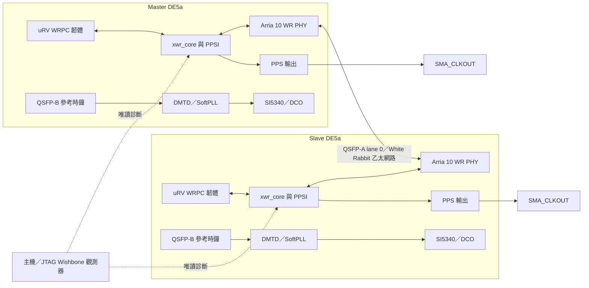

# DE5a White Rabbit — Step7 實體 PPS 同步：階段性驗證

最新紀錄整理日期：**2026-10-07**；分支：`step7-physical-measurement`。

Step6 與 Step7 milestone 現在也已提交完整展開的 **`source/`**，可直接在資料夾內
依序 build → compile → program → dashboard，不必先解壓。
`source/` 為可寫建置工作區，頂層壓縮封存與原始 SOF 維持唯讀。
請參閱 [Step6 編譯方式](artifacts/milestones/step6_global_time/SOURCE_USAGE.md)
或 [Step7 編譯方式](artifacts/milestones/step7_physical_measurement/SOURCE_USAGE.md)。

將 Master 與 Slave 的 SMA PPS 輸出接入 **RIGOL DS1104Z Plus** 示波器後，
可觀察到兩台脈衝的上升緣在**奈秒（ns）等級對齊**。
使用者在本次觀測期間未見明顯漂移；此結果作為 White Rabbit
**實體同步的階段性驗證**，不等同於已完成校準的皮秒（ps）精度認證。


### 輸出訊號：每秒一次、脈寬 10 ms 的 PPS

- 參考時鐘為 **125 MHz**，**Clock Period = 8 ns**。
- PPS 的重複週期為 **1 秒（1 Hz）**，不是 8 ns。
- 脈寬設定為 **10 ms**，對應 **1,250,000 個 8 ns 時鐘週期**，占空比約 1%。
- 兩台 top-level 的 `SMA_CLKOUT` 都連接 WR Core 的 `pps_p_o`；SMA 輸出不是連續的 125 MHz clock。

以上為設定值與原始碼核查；這張 5 ns/div 的局部上升緣截圖本身，
不能驗證完整的 10 ms 脈寬或 1 秒重複週期。

### 示波器觀測結果與量測限制

本次畫面為 **500 MSa/s**，即每 **2 ns** 取得一個樣本；水平刻度為 **5 ns/div**。
CH1 黃色為 Master，CH2 青色為 Slave。畫面中的 CH1→CH2 上升緣延遲統計為：

| 指標 | 示波器顯示值 |
|---|---:|
| 平均延遲 | −86.44 ps（−0.08644 ns） |
| 最小／最大延遲 | −1.700 ns／+1.400 ns |
| 顯示統計的峰對峰範圍 | 3.100 ns |
| 當前延遲 | −600.0 ps（−0.6000 ns） |

圖上標註的 **60 次 pulse** 為使用者提供的統計次數，未附逐筆波形資料。
延遲正負號依示波器 CH1→CH2 的量測定義記錄。

數位示波器取得的是離散採樣點；顯示曲線與邊緣時間估計可能使用插值／重建。
因此，小於 2 ns 的延遲估計並非不可能，但**顯示到 ps 位數不代表具備相同的實際量測準確度**。
估計結果仍受插值方法、100 MHz 類比頻寬、雜訊、邊緣門檻及兩路通道／線材延遲影響。
本圖未記錄所選插值模式，也未提供通道與線材去偏差校準。
儀器頻寬與採樣規格可參閱 [RIGOL 官方 DS1000Z 資料表](https://www.rigol.com/dam/global/downloads/brochures/en/data-sheet/oscilloscopes/DS1000Z_DataSheet_EN.pdf)。

所以，本次支持的是**奈秒等級的實體脈衝對齊**，不是「同步誤差已被證明為 −86.44 ps」。
「未見明顯漂移」是本次使用者的觀察；單張統計截圖無法量化長時間漂移、
抖動分布或重新啟動的可重現性，也不能拿它替代新的 TIME_VALID 300 秒驗證。
此處的示波器通道延遲與韌體 CKO 是不同的量測量，不混為一談。

[完整 Step7 觀測報告](experiments/step7/EXP-S7-PHYSICAL-PPS-SMA-OBSERVATION-20261007/REPORT.md)
· [唯讀 Step7 milestone：程式碼、腳本、儀表板與 SOF](artifacts/milestones/step7_physical_measurement/README.md)

目前可編輯主程式保留 Step7 的 Slave bootstrap=512、Master bootstrap=2048，
WR 相位取得 `/2`、追蹤 `/12`，60/120 ps 門檻不變。
本次只整理使用者量測與封存，沒有修改控制程式、重新燒錄或合併 main。
現有 SOF 建置來源為 `4d7e38189e26707afffb2ecc404f3ad0e8a08326`；
本次截圖未附量測當時的 loaded-image 識別紀錄，故不把它當成 exact-image 重現證明。

## 歷史 Step6：TIME_VALID 維持 300 秒（原拓樸，2026-10-05）

歷史實機驗證：**2026-10-05，切入 Step7 前的 Pain 主程式既有運行狀態**。
Master 在 **302.874 秒**內有 **1190/1190** 筆有效採樣；Slave 在
**302.667 秒**內有 **359/359** 筆有效採樣。兩台分別通過原有的
TIME_VALID 300 秒採樣門檻，無無效採樣或讀取錯誤。
Slave 的五項 PLL 鎖定信號在 359/359 筆讀取中皆為 1，採樣中的重置資訊也未改變。
兩台是依序觀測，並非同時量測。

## Slave CKO 隨時間變化


觀測時間：2026-10-05 **11:34:03–11:39:06，臺北時間（Asia/Taipei）**。
橫軸為開始觀測後經過的秒數，縱軸為 CKO，單位是皮秒（ps）。
243 筆可信且不重複的更新介於 **−490～+459 ps**，峰對峰為
**949 ps（0.949 ns）**，中位數 **−44 ps**，標準差 **171.3 ps**。
已排除 70 筆不可信的相位資料與 46 筆重複更新；折線不跨越被排除的採樣。
下方獨立面板保留全部 359 筆原始 TIME_VALID 狀態讀取。

**TIME_VALID 維持門檻已通過；尚未證明 offset 能長時間維持在 ±60/120 ps。**
CKO 是 WR 時間戳記／伺服控制的診斷值，不是實體振盪器抖動或 SMA/PPS 邊緣時間差的量測。
冷啟動可重現性與時序收斂仍是獨立限制；時序收斂不是本次通過門檻。

[完整觀測報告](experiments/step6/EXP-S6-LIVE-TIME-VALID-CKO-300S-PROMOTION-20261005/REPORT.md)
· [CSV](experiments/step6/EXP-S6-LIVE-TIME-VALID-CKO-300S-PROMOTION-20261005/analysis/cko-timeseries.csv)
· [SVG](experiments/step6/EXP-S6-LIVE-TIME-VALID-CKO-300S-PROMOTION-20261005/analysis/cko-timeseries.svg)
· [原始觀測紀錄](experiments/step6/EXP-S6-LIVE-TIME-VALID-CKO-300S-PROMOTION-20261005/raw/observe/cko-303s.log)

## 主程式：建置 → 編譯 → 燒錄 → 開啟儀表板

```sh
cd /home/b10504072/04_WR
bash scripts/build/build_current.sh
bash scripts/build/compile_current.sh
bash scripts/program/program_current.sh
bash scripts/monitor/step1_6_dashboard.sh
```

前一步成功後才執行下一步；燒錄前請停止其他 JTAG 讀取程序。
新 SOF 存放於 `output/DE5a_wr_master_jtag.sof` 與 `output/DE5a_wr_slave_jtag.sof`。
保留原本可編輯的操作流程，不加入 SHA 驗收檢查。
實際 WR 控制參數為相位取得 `/2`、追蹤 `/12`，狀態切換門檻維持 60/120 ps。
歷史「不校正」實驗的資料夾名稱，不代表目前載入的韌體模式。

本歷史 Step6 觀測的產物來自 `bcb84305`，紀錄整理於 `9b8a231c`；不是目前 Step7 的 SOF。
本次只觀測既有運行狀態，未重新建置、燒錄、重置、斷電、修改控制參數，
也未變更唯讀 Step6 milestone 或封存資料夾。
本次證據驗證的是這次運行狀態，不保證每次未來啟動都會成功。
儀表板 Step5 的 `INFO/LOCK_ACQUIRED_NOT_STABLE` 是短觀測窗的顯示結果，
不會推翻上述 359 筆長時間鎖定觀測。

## 歷史紀錄：僅還原 milestone 原始碼（2026-10-04）

以下保留歷次實驗當時的說明、門檻與產物版本，並於 2026-10-08 統一翻譯為繁體中文。
文中的「當時」設定不代表目前啟用的設定；最新狀態與操作方式請以上方 Step7 說明、
[Step6 編譯方式](artifacts/milestones/step6_global_time/SOURCE_USAGE.md)及
[Step7 編譯方式](artifacts/milestones/step7_physical_measurement/SOURCE_USAGE.md)為準。

主程式原始碼已還原為唯讀封存
`artifacts/milestones/step6_global_time/source.tar.gz` 的內容。
WR 相位校正重新啟用：恢復初始化，相位取得使用 `/2`、追蹤使用 `/12`，
60/120 ps 狀態切換門檻不變。已封存的 milestone 與受保護的 Pain archive 均未修改。

這次**沒有從 milestone 還原腳本**，保留原本可編輯的操作流程，
不加入 SHA 驗收檢查。從 Pain 主資料夾依序執行以下四個指令，
即可產生並部署新的主程式產物：

```sh
cd /home/b10504072/04_WR
bash scripts/build/build_current.sh
bash scripts/build/compile_current.sh
bash scripts/program/program_current.sh
bash scripts/monitor/step1_6_dashboard.sh
```

燒錄前請停止所有儀表板／JTAG 讀取程序。
這次還原本身沒有編譯、燒錄或替換既有 SOF，也沒有建立新的 TIME_VALID 300 秒 PASS。
milestone 保留了歷史 300 秒採樣成功的紀錄，也記錄過全新獨立啟動未能完成相位取得；
相同原始碼不保證每次啟動都會鎖定。

額外的歷史診斷與實驗紀錄仍保留，但不屬於目前四步驟操作流程。
「不校正」觀測器及其原始碼測試描述的是前一輪診斷，不是此次啟用的控制器。
未改動的腳本設定仍使用前一輪診斷的 log 資料夾名稱；
該名稱不能用來識別實際載入的韌體。
詳見[還原紀錄](experiments/step6/EXP-S6-MAIN-RESTORE-SEALED-MILESTONE-SOURCE-20261004/REPORT.md)。

## 前一輪診斷：關閉 WR 相位校正（2026-10-04）

前一輪診斷將 `WRH_PHASE_CORRECTION_ENABLED=0`，
使初始化、相位取得與追蹤都不執行 WR 相位設定值的運算／寫入。
這是使用者要求「/0+/0」的安全實作方式，**不是除以零**。
`/2+/12` 參考控制分支與 60/120 ps 門檻仍保留，但相位校正分支在編譯時被停用。
CKO 量測仍持續運作，SoftPLL 與粗時間同步也維持運作。
這不是實體振盪器抖動量測，也不是 Step6 PASS。

將原始碼的模式預設值設回 1，即可恢復 `/2+/12`，之後需重新建置／燒錄。
當時只完成程式碼準備，助手沒有更新既有 SOF 或硬體。
詳見[診斷計畫](experiments/step6/EXP-S6-WRH-NO-PHASE-CORRECTION-CKO-OBSERVATION-20261004/PLAN.md)。
修改原始碼後，從 Pain 主資料夾執行：

```sh
cd /home/b10504072/04_WR
bash scripts/run_current.sh
```

也可以設定燒錄成功後先等待 15 分鐘，再顯示儀表板：

```sh
POST_PROGRAM_WAIT_S=900 bash scripts/run_current.sh
```

四個獨立指令仍為 `scripts/build/build_current.sh`、
`scripts/build/compile_current.sh`、`scripts/program/program_current.sh`、
`scripts/monitor/step1_6_dashboard.sh`，各自以 `bash` 執行。
新的 SOF 存放於 `output/DE5a_wr_master_jtag.sof` 與
`output/DE5a_wr_slave_jtag.sof`。

可編輯的主程式流程不要求固定 SHA、乾淨的 Git 工作目錄或 SHA 驗證；
雜湊值僅作為實驗紀錄。
建置錯誤、缺少輸出或其他 JTAG 程序競爭仍會中止流程。
執行另一個讀取器／燒錄器前請停止儀表板；凍結 milestone 不變。

完成一次成功的全新建置／燒錄後，可停止儀表板，再選擇執行
`bash scripts/monitor/observe_cko_no_correction.sh`，
取得經可信度檢查的 303 秒 Slave CKO 資料，以及最小值／最大值／峰對峰摘要，
並保存於當輪實驗資料夾。
此觀測器不會建置、燒錄、重置或強制設為有效，
也無法獨立識別已載入的韌體；結果必須以實際硬體觀測為依據。

## 前一次要求的還原：僅修改原始碼

前一次 `/2+/12` 還原已同步，但依使用者要求，助手沒有重新建置或燒錄。
其計畫保留於[此處](experiments/step6/EXP-S6-WRH-RESTORE-ACQ2-TRACK12-TIME-VALID-20261004/PLAN.md)。

## 前一次 /24+/24 候選：保留失敗結果

詳見[前一次候選計畫](experiments/step6/EXP-S6-WRH-ACQ24-TRACK24-15MIN-SETTLING-20261004/PLAN.md)。
當時已完成全新建置／燒錄與 15 分鐘穩定等待，Slave 仍為 TIME_VALID=0。
後續在 301797 ms 內取得 250 筆可信的新更新，CKO 為 −2085～+2986 ps，
沒有任何一筆位於 ±120 ps 內，五項 PLL 鎖定皆為 1。
**此 /24+/24 候選不是 TIME_VALID 300 秒 PASS。**

當時 Git 保留的輸出為 `6eb0c2c1` 的 /24 SOF，
不是後來的新診斷實作；Pain 可能另有使用者自行建置的版本。
燒錄此候選前應先執行完整流程。
詳見[已完成的實驗報告](experiments/step6/EXP-S6-WRH-ACQ24-TRACK24-15MIN-SETTLING-20261004/REPORT.md)。

# 前一次目標：TIME_VALID 300 秒——保留相同映像的失敗紀錄

前一次從主資料夾全新重跑，在 FPGA 組態相同的情況下仍重現相位取得失敗：
Slave 五項 PLL 鎖定皆為 1，Main 有 231/231 筆有效 frame 與 230 個持續前進的區間，
但在 600 秒相位取得觀測窗的 789 筆通過檢查資料中，TIME_VALID 皆為 0。
後來讀到的 Slave 實際相位目前值／目標值為 5312/5312 ps；
最後 CKO=−2317 ps，狀態為 WAIT。

這不是缺少 Main 更新串流，也不能證明相位移動器一直卡住。
該輪 `output/` 是 `640436ca` 的實際編譯產物，不是新通過 300 秒驗證的映像。
相同 RBF 下，校準／執行時相位仍可能不同；其因果意義尚未釐清。
詳見[當時保留的失敗報告](experiments/step6/EXP-S6-SAME-IMAGE-MAIN-PHASE-READBACK-STARTUP-20261004/REPORT.md)。

正式 milestone／archive 維持不變。
下方較早的成功紀錄是歷史證據，不是該次啟動的結果。

## 前一次相同映像重跑：成功，但啟動尚非確定可重現

從**主資料夾**全新建置／編譯／燒錄，再次通過兩板 300 秒採樣驗證：
Master／Slave 各有 1190/1190 筆有效資料，跨度分別為 302852/302870 ms。
該輪 `output/` 是 `3bf9f3b4` 的實際建置產物，不是新的控制候選。

全部 3117 個主程式輸入／MIF 均未改動；
FPGA RBF 內容與已通過驗證的主程式，以及較早失敗的獨立啟動版本完全一致。
啟動追蹤首次觀察到 TIME_VALID 時，觀測器已經過 159381 ms。
**啟動時能否確定完成相位取得仍為 NOT_ESTABLISHED（尚未建立證據）。**
當次 TIME_VALID PASS 不代表 ±120 ps 精度；
最後 CKO=−1987 ps，validity 仍為 1。

詳見[當時的相位取得／維持診斷](experiments/step6/EXP-S6-IDENTICAL-IMAGE-STARTUP-ACQUISITION-ATTRIBUTION-20261004/REPORT.md)。
該輪診斷沒有修改 milestone 或受保護 archive。

## 已通過的基準版本與獨立 milestone 重現限制

當時主資料夾的候選為 `EXP-S6-MAIN-ROOT-TIME-VALID-300S-BACKTRACK-20261003`。
使用者恢復以「只要求 TIME_VALID」作為門檻；
主資料夾還原了 `0bb02c6f` 的 3110 個已通過驗證的主程式輸入。
主資料夾實驗期間，凍結 milestone／archive 均未修改。

新的主資料夾建置／燒錄／觀測已完成：**兩板 TIME_VALID 300 秒 PASS**。
Master 為 1191/1191 筆、302747 ms；Slave 為 1190/1190 筆、302799 ms，
無無效採樣。
採用的是歷史 WR validity 行為，不是已被取代的 strict full64 offset 撤銷判定。
這不能證明 offset 維持在 ±120 ps、絕對時間精度或實體 PPS 邊緣偏差。

從主資料夾依序執行相同的四個腳本：
`build_current.sh`、`compile_current.sh`、`program_current.sh`、
`step1_6_dashboard.sh`，位於各自原有的 `scripts/` 子資料夾。
啟動另一個 JTAG 讀取器前請停止儀表板。
驗收使用 `scripts/monitor/verify_time_valid_300s.sh`，不是單張儀表板 frame。
詳見[當輪計畫](experiments/step6/EXP-S6-MAIN-ROOT-TIME-VALID-300S-BACKTRACK-20261003/PLAN.md)
及[已完成的主資料夾報告](experiments/step6/EXP-S6-MAIN-ROOT-TIME-VALID-300S-BACKTRACK-20261003/REPORT.md)。

正式 Step6 只保留此已通過驗證的主資料夾版本。
新的獨立建置／燒錄雖成功，但在同一 session 內兩次等待 600 秒，
仍未取得 Slave TIME_VALID：
**全新獨立啟動的 300 秒重現為 NOT_ESTABLISHED（尚未建立證據）**。
主資料夾與全新獨立版本的 RBF 組態逐位元組相同，
但不能保證每次啟動都能取得相同鎖定結果。
未通過驗收的產物保存於正式封存外。
詳見[milestone 重現報告](experiments/step6/EXP-S6-MILESTONE-MAIN-ROOT-TIME-VALID-300S-REPRO-20261003/REPORT.md)。

下方嚴格 offset 研究是歷史背景，不是該輪驗收門檻。

# DE5a White Rabbit

此儲存庫開發並記錄 Terasic DE5a／Arria 10 上的雙板 White Rabbit 系統。
目前唯一主要硬體操作流程為透過 JTAG 的 Master／Slave 設計；
凍結 milestone 快照保留各個已驗證的研究檢查點。

## 歷史嚴格 offset 研究（門檻與產物已被取代）

**歷史嚴格 WR validity 候選：未通過驗收。**

歷史實驗：`EXP-S6-MASTER-RXTS-CALIBRATION-ROLE-EXCHANGE-20261003`。
已準備有範圍限制、使用相同 gateware 的角色交換，以及被動校準狀態查詢。
原生測試／建置／燒錄／硬體校準當時尚待執行；
不猜測 T24P，也不修改增益或嚴格判定門檻。
完成實際的新編譯前，output 仍是前一輪診斷產物。
詳見[當輪計畫](experiments/step6/EXP-S6-MASTER-RXTS-CALIBRATION-ROLE-EXCHANGE-20261003/PLAN.md)。

前一個已完成實驗：`EXP-S6-NEAREST-MAIN-TIMESTAMP-EXACT-JOIN-20261003`。
已完成被動觀測，依實際通過檢查的更新精確配對。
原生／韌體測試、全新雙板完整編譯，以及一次 Slave→Master 燒錄，
均以 `1ab27d25c6935ed5e6ddb5af129982f66a2265ac` 完成。
當時主資料夾 output 為這組實際診斷 SOF，不是嚴格門檻 PASS milestone。

主程式輸入／MIF 未改動；
觀測器修正 `8b7e211b` 不需重新燒錄。
取得 16 筆精確共同更新；Main 在 15/15 個區間持續前進，共 58876 次更新。
四次未伴隨控制動作的 CKO 約 4 ns 跳變，對應回傳路徑約 8 ns 的變化。
接受更新後的 Main error 為 −239～+183 ps，但不是與封包時間原子一致的資料。
嚴格門檻啟動／相位取得／結束後檢查：0 次新鮮的 <60 ps 進入、
合格維持時間 0 ms，沒有延長為 300 秒觀測。
下一個邊界是 Master RX 粗／細時間的連續性與校準來源，不是自動掃描 Ki。
詳見[已完成報告](experiments/step6/EXP-S6-NEAREST-MAIN-TIMESTAMP-EXACT-JOIN-20261003/REPORT.md)。

同次啟動的後續觀測取得 16 組精確 Master RX→Slave T4 配對，
將一次 8.54 ns 回傳變化定位到細時間線性化，而粗時間回傳值保持不變。
該變化發生於 WR 控制動作之後，不屬於無控制動作的跳變。
Master T24P 仍為未實測的 2389 ps；
下一步是有範圍限制、相同 gateware 的校準，而不是猜測設定值。
詳見[後續紀錄](experiments/step6/EXP-S6-NEAREST-MAIN-TIMESTAMP-EXACT-JOIN-20261003/SAME_BOOT_FOLLOWUP.md)
及[當輪計畫](experiments/step6/EXP-S6-NEAREST-MAIN-TIMESTAMP-EXACT-JOIN-20261003/PLAN.md)。

前一個已完成實驗：`EXP-S6-MAIN-NEAREST-STEP-ADMISSION-20261003`。
以 `a45da74188d9ae325ac1c176bde74920018c0be4` 完成全新雙板編譯與一次
Slave→Master 燒錄。其 nearest-admission SOF 已被上方配對診斷產物取代，
但沒有刪除歷史證據。
Slave admission 為向上 8／向下 9，中點相等時的判定一致；completion 仍為 16。
Master、Helper、韌體／Kp600／Ki1、嚴格 60/120 ps 門檻與觀測器不變。

原生／原始碼／韌體測試通過。
60 筆一致性快照中，Main 在 59/59 個區間前進，共 9526 次完成；
residual 為 −11～+11，CKO 為 −254～+143 ps。
嚴格相位取得／結束後檢查的合格跨度為 3187/607 ms，未延長至 300 秒。
最後 Slave 無效、CKO=104 ps，表示曾超出範圍後處於 WAIT，
不是誤宣稱 validity 成立。
詳見[已完成報告](experiments/step6/EXP-S6-MAIN-NEAREST-STEP-ADMISSION-20261003/REPORT.md)、
[當輪計畫](experiments/step6/EXP-S6-MAIN-NEAREST-STEP-ADMISSION-20261003/PLAN.md)
及[建置前檢查](experiments/step6/EXP-S6-MAIN-NEAREST-STEP-ADMISSION-20261003/BUILD_PRECHECK.md)。

前一輪實驗：`EXP-S6-MAIN-DCO-APPLICATION-CORRELATION-20261003`。
以 `f0f0f7ef14b4e1a139f80e1ce131ecaa042575f1` 完成全新原生等價性測試、
完整編譯與一次雙板燒錄；這組被動觀測產物已被取代，證據沒有刪除。
韌體／控制維持 Kp600 版本不變。

最終觀測器原始碼 `70193e25` 修正 session 所有權、實際 Quartus instance 組合，
以及各自獨立、每組七次讀取的資料發布組，不需重新燒錄。
60 筆一致性快照：Main 在 59/59 個區間前進，641 次完成，延遲 1.22882 ms；
59/60 筆 residual 小於 16 code，但 CKO 為 −201～+227 ps。
嚴格相位取得／結束後檢查的合格跨度為 604/0 ms，未延長至 300 秒。
最後 TIME_VALID=1／CKO=−55 ps，只是逐點結果。
詳見[DCO 關聯報告](experiments/step6/EXP-S6-MAIN-DCO-APPLICATION-CORRELATION-20261003/REPORT.md)。

上方 nearest-admission 測試沒有建立穩定 WR offset 的證據。
下一個邊界是具一致性的 Main 相位／tracker 與時間戳記來源，
不是自動掃描 Ki／增益；實體步階與嚴格 60/120 ps 門檻不變。
下方較早的 Kp600 產物已被取代，證據沒有刪除。

前一次實驗：`EXP-S6-MAIN-KP600-STRICT-OFFSET-HOLD-20261003`。
以 `78948729bc18c5a78aaede3b6a8f7a363042efc7` 完成原生測試、
完整編譯與一次雙板燒錄；這些產物已被取代，不是嚴格門檻 PASS 映像。
唯一功能變因是 Slave 共用 Main Kp 從 300→600；
Ki=1 與全部門檻固定不變。
Master MIF 相同；Slave binary 只有兩個指令位元組改變。
Main phase error 縮小至 −198～+229 ps，但 WR CKO 仍為 −301～+274 ps。
120 秒相位取得／結束後檢查的最長合格維持時間為 2109/901 ms，
未延長至 300 秒。
最後 TIME_VALID=1／CKO=−105 ps，只是逐點結果。
詳見[Kp600 報告](experiments/step6/EXP-S6-MAIN-KP600-STRICT-OFFSET-HOLD-20261003/REPORT.md)。

前一次相位／更新進度實驗以 `25603ae2` 完成；產物已被取代，證據沒有刪除。
Main／tracker 在 31/31 個區間前進；
Main error 為 −411～+502 ps，WR CKO 為 −307～+242 ps，
合格維持時間為 603/605 ms。
詳見[相位／更新進度報告](experiments/step6/EXP-S6-MAIN-PHASE-PTRACKER-PROGRESS-CORRELATION-20261003/REPORT.md)。

更早的配對來源實驗保留如下供比較：SOF 已被取代，證據沒有刪除。
該輪只增加觀測，原生測試、兩份完整編譯與一次 Slave→Master 燒錄，
皆以 `31bfaeb55f667719dbcc8690139f859598683ed4` 完成。
其診斷 SOF 已被取代，不是嚴格門檻 PASS milestone。
主程式輸入與 MIF 固定值均未改動。

全部 32 筆 Master／16 筆 Slave 紀錄通過檢查；
14 筆通過檢查的 T4 值精確對應 Master RX，取得 13 組連續差值。
這批快照未重現約 4 ns 跳變，但未伴隨控制動作的 CKO 仍變動約 926 ps。
120 秒啟動觀測有 9 次新鮮的 <60 ps 進入，合格維持僅 1501 ms；
結束後檢查未通過延長觀測的門檻。
詳見[配對報告](experiments/step6/EXP-S6-MASTER-RX-TO-SLAVE-T4-PAIRED-PROVENANCE-20261003/REPORT.md)。

當時原始碼恢復正常的相位取得 /2、追蹤 /12，
並新增同一次更新的被動四時間戳記／RTT RAM 歷史資料。
前一輪以 `4e0c2324095c8644dac7fb5426f69de0eadb392c` 完成全新雙板建置／燒錄；
診斷產物後來被配對實驗取代。
全部 16 筆連續時間戳記紀錄通過關係式檢查。
未伴隨控制動作的回傳路徑約 8.2 ns 跳變，對應 CKO 約 4.2 ns 跳變。
120 秒相位取得觀測曾達到 <60 ps，但合格維持僅 2102 ms；
結束後檢查未符合延長觀測的門檻。
詳見[已完成報告](experiments/step6/EXP-S6-COHERENT-FOUR-TIMESTAMP-RTT-DIAGNOSTIC-20261003/REPORT.md)。

更早完成的固定設定值診斷，以 `fbd8febf3eab38e6d2734f859d911f1e6b10365f`
成功完成全新雙板建置與一次 Slave→Master 燒錄；產物已被取代。
首次進入嚴格門檻後，WR 設定值被凍結，
但超過 120 ps 仍會撤銷 Slave 時間有效性，且該次啟動不會自動重新啟用。
這不是主程式 PASS 映像。

較晚進入的唯讀觀測發現 CKO／DMS 接近 4 ns 的跳變；
WR phase-write／init count 與 SETP 均未改變。
38 筆新更新未達預設 40 筆的診斷門檻。
嚴格 300 秒判定仍為 NOT_ESTABLISHED，診斷為 INCONCLUSIVE（資料不足以判定）。
詳見[報告](experiments/step6/EXP-S6-FIRST-ENTRY-FIXED-SETP-STRICT-VALIDITY-20261003/REPORT.md)。

更早的原始碼新增封包專屬的被動時間戳記 RAM 快照；
以 `13d5c99b2b1898cf9cd9d9864288f7f9d5cccccf` 完成兩份全新編譯／燒錄，
後來被固定 SETP 版本取代。
90 秒預檢曾達到 <60 ps，合格跨度 2669 ms，不是 300 秒。
封包運算已驗證，但細時間穩定性仍為 NOT_ESTABLISHED。
詳見[RXTS 報告](experiments/step6/EXP-S6-RXTS-RAW-AHEAD-PHASE-DIAGNOSTIC-20261003/REPORT.md)。

當時要求的嚴格門檻還包含 <60 ps 相位取得，以及 300 秒維持在 ±120 ps 內，
超出範圍就撤銷 Slave validity。較早只要求 TIME_VALID 的 PASS 無法證明此門檻。
更早的角色修正候選由 `4ba9df5935fc0a6afae2c7bd29603f190936e627` 編譯，
並於 2026-10-02 燒錄。
Master validity 恢復，但已完成的 660 秒嚴格觀測沒有 <60 ps 進入，
CKO 為 −3158～+3839 ps，無合格維持時間；Slave 正確保持無效。
這些不是 PASS milestone 映像。後續若修改主程式原始碼，仍需重新建置。

**歷史 Step6：只要求 TIME_VALID 的 PASS——主資料夾兩輪重現（2026-10-02）。**

歷史實驗：`EXP-S6-MASTER-HPLL-STEP64-REPEATABILITY-20261002`。
每輪都重新建置韌體、完整編譯兩份 FPGA 專案，
先燒錄 Slave 再燒錄 Master，並各自採樣超過 300 秒。
四個觀測窗皆為 1192/1192 筆 TIME_VALID，沒有無效採樣或傳輸錯誤。
兩輪使用相同的 3110 個主程式輸入與韌體 MIF。
詳見[驗收報告](experiments/step6/EXP-S6-MASTER-HPLL-STEP64-REPEATABILITY-20261002/REPORT.md)。

凍結 Step6 封存也通過一次新的獨立資料夾建置／編譯／燒錄重現：
Master／Slave 各有 1192/1192 筆有效採樣，跨度為 302952/302872 ms。
詳見[獨立重建報告](experiments/step6/EXP-S6-MILESTONE-STANDALONE-FRESH-REBUILD-TIME-VALID-300S-20261002/REPORT.md)。

主程式變因為 Master `HPLL_TRACKER_CODE_PER_PHYSICAL_STEP` 從 34→64；
Master bootstrap 維持 2048，Slave 控制維持相位取得 /2、追蹤 /12。
驗收後 Master Helper 已鎖定，相位 tracker 也已準備完成。
更早的逐位元組相同 bootstrap2048 封存，在重新燒錄後曾失敗；
單純複製一致不能當作重現證據。
該失敗保留於新報告中，沒有被此次 PASS 隱藏。

[單一 Step6 milestone](artifacts/milestones/step6_global_time/README.md)
包含已通過驗證的原始碼、全部腳本／儀表板、產物與證據。
當時操作方式是在該處執行 `prepare_source.sh`，再使用獨立的 `source/` 資料夾；
目前已發布的 source 操作方式請以上方 SOURCE_USAGE.md 為準。
只有 `artifacts/milestones/` 保存凍結的可操作快照；
`experiments/` 保存證據，不是另一套目前建置入口。

這是使用者訂定的「採樣中只要求 TIME_VALID」門檻。
依序讀取兩台板子，不能證明實體時間精度、每個週期連續有效、
offset <60 ps，或每次啟動都可靠。此門檻不要求 timing closure。

## 當時的四步驟操作流程

在 Pain 的 `/home/b10504072/04_WR` 執行：

```sh
bash scripts/build/build_current.sh          # 1. 建置韌體
bash scripts/build/compile_current.sh        # 2. 編譯兩份 FPGA 映像
bash scripts/program/program_current.sh      # 3. 先燒錄 Slave，再燒錄 Master
bash scripts/monitor/step1_6_dashboard.sh      # 4. 持續唯讀儀表板
```

保留映像為 `output/DE5a_wr_master_jtag.sof` 與
`output/DE5a_wr_slave_jtag.sof`，附建置資訊與檢查碼。
韌體 binary／MIF 及編譯報告保留於 `build/`。
執行任何驗收器前請停止儀表板。
`bash scripts/monitor/verify_time_valid_300s.sh` 檢查當輪採樣中只要求 TIME_VALID 的門檻。
`verify_strict_offset_time_valid_300s.sh` 保留供已被取代的精度研究使用；
儀表板或只檢查狀態位元的驗收器，都不能證明該較嚴格的精度門檻。
時序收斂不是此門檻。
正在運行的啟動若失敗，應先保存相位取得證據，再重新燒錄。

韌體版本字串固定，以利重現；
被動診斷會改變 MIF，並另有固定的雜湊值紀錄。
`output/SOURCE_COMMIT` 記錄實際編譯所用版本。
新的編譯／匯出完成前，`output/` 保留的仍是前一輪產物；
當時的原始碼清單檢查可避免將舊檔誤當成新原始碼產物燒錄。

## 系統架構


```mermaid
flowchart LR
  subgraph M["Master DE5a"]
    MCPU["uRV WRPC 韌體"] <--> MCORE["xwr_core 與 PPSI"]
    MCORE <--> MPHYS["Arria 10 WR PHY"]
    MREF["QSFP-B 參考時鐘"] --> MDMTD["DMTD／SoftPLL"]
    MDMTD --> MDCO["SI5340／DCO"]
    MCORE --> MPPS["PPS 輸出"]
  end
  subgraph S["Slave DE5a"]
    SCPU["uRV WRPC 韌體"] <--> SCORE["xwr_core 與 PPSI"]
    SCORE <--> SPHYS["Arria 10 WR PHY"]
    SREF["QSFP-B 參考時鐘"] --> SDMTD["DMTD／SoftPLL"]
    SDMTD --> SDCO["SI5340／DCO"]
    SCORE --> SPPS["PPS 輸出"]
  end
  MPHYS <-->|QSFP-A lane 0／White Rabbit 乙太網路| SPHYS
  JTAG["主機／JTAG Wishbone 觀測器"] -. 唯讀診斷 .-> MCORE
  JTAG -. 唯讀診斷 .-> SCORE
  MPPS --> MSMA["SMA_CLKOUT"]
  SPPS --> SSMA["SMA_CLKOUT"]
```

此圖是功能概觀，不是接腳層級的線路圖。
每張板子執行 White Rabbit core 與 WRPC 韌體；
Master／Slave 角色各自使用唯一的 endpoint 身分。
QSFP-A lane 0 是固定的板間 WR 乙太網路資料路徑。
本地參考時鐘送入 DMTD；SoftPLL 使用 DMTD 相位量測控制以 SI5340 為基礎的 DCO。
WR core 的 PPS 輸出連到 `SMA_CLKOUT`。
PHY／link 健康本身，不能證明 PTP 時間有效、PPS 有效、SoftPLL 已鎖定或全域時間一致。

設計使用 Arria 10 White Rabbit PHY，以及它所需的產生式 IP 輸入。
Master／Slave 是兩個獨立的 JTAG Quartus 專案，top-level entity 如下。
Pain 上的板卡 cable 名稱：Master 為 `DE5 [1-11.1]`，Slave 為 `DE5 [1-11.2]`。
執行狀態與 Wishbone 寄存器透過 `scripts/jtag/` 內的 JTAG 腳本觀測；
Step1～6 儀表板為唯讀。

JTAG top-level 中以 RS422 命名的接腳，只保留作 WRPC 實體 UART 文字主控台旁路。
它們不構成第二種 White Rabbit 架構，也不是另一套建置／燒錄／診斷流程；
目前 FPGA 專案的建置／燒錄，以及 milestone 驗收／診斷觀測均使用 JTAG。
UART 旁路只能作為 WRPC 文字主控台。

正式 Quartus top-level entity：

```text
DE5a_wr_master_jtag
DE5a_wr_slave_jtag
```

## 當時的 milestone 狀態

Step1～5 保留各自獨立驗證的凍結檢查點。
當時單一 Step6 封存為 Master step64 版本，已通過兩輪主資料夾全新完整重跑。
當輪映像位於 `output/`。
較早的共同 PPS／數位觸發結果保留於各實驗報告，不另作第二套 Step6 封存。
詳見 [STATUS.md](STATUS.md) 與 [MILESTONES.md](MILESTONES.md)。

## 重現已驗證的 Step2 檢查點

已驗證 milestone 使用 Quartus Prime Standard Edition 17.0.0 Build 595，
以及 RISC-V 韌體工具鏈。
在 Pain 設好 Quartus 執行檔與工具鏈 `PATH`，再從儲存庫根目錄執行：

```sh
cd artifacts/milestones/step2_endpoint_ptp/source
bash scripts/build/build_master.sh
bash scripts/build/build_slave.sh
CABLE='DE5 [1-11.1]' bash scripts/program/program_master.sh
CABLE='DE5 [1-11.2]' bash scripts/program/program_slave.sh
```

燒錄腳本使用該凍結 source 資料夾內重新建置的 JTAG 映像。
此 Step2 重現已驗證的燒錄順序是先 Master、再 Slave。
建置成功不等於執行時驗證通過；
請依 milestone README 與實驗報告的驗收程序操作。

## 重現已驗證的 Step3 檢查點

2026-09-24 實際燒錄並驗證的 Step3 SOF：

- Master：[`artifacts/milestones/step3_wr_handshake/master.sof`](artifacts/milestones/step3_wr_handshake/master.sof)
- Slave：[`artifacts/milestones/step3_wr_handshake/slave.sof`](artifacts/milestones/step3_wr_handshake/slave.sof)

Pain 的獨立建置輸出位於
`artifacts/milestones/step3_wr_handshake/source/quartus/output_files_master_jtag/DE5a_wr_master_jtag.sof`
與
`artifacts/milestones/step3_wr_handshake/source/quartus/output_files_slave_jtag/DE5a_wr_slave_jtag.sof`。
SHA-256 與上方兩個檔案相同。
使用 `artifacts/milestones/step3_wr_handshake/source/scripts/program/` 的腳本，
先燒錄 Master，再燒錄 Slave。
精確驗證邊界與限制請參閱
[Step3 milestone README](artifacts/milestones/step3_wr_handshake/README.md)。

## 重現已驗證的 Step4 SoftPLL 啟動檢查點

2026-09-24 從凍結原始碼重建並燒錄的 Step4 SOF：

- Master：[`artifacts/milestones/step4_softpll_startup/master.sof`](artifacts/milestones/step4_softpll_startup/master.sof)
- Slave：[`artifacts/milestones/step4_softpll_startup/slave.sof`](artifacts/milestones/step4_softpll_startup/slave.sof)

SHA-256 記錄於 milestone 的 `SHA256SUMS` 與 `MILESTONES.md`。
獨立原始碼快照位於 `artifacts/milestones/step4_softpll_startup/source/`。
依其 README 從該目錄重建兩份專案。
已驗證的燒錄順序是先 Master，等待約 45 秒，再 Slave。
請依[Step4 milestone README](artifacts/milestones/step4_softpll_startup/README.md)
與[Step4 重現報告](experiments/step4/EXP-S4-MILESTONE-REPRO-20260924/REPORT.md)
的驗收程序及已知限制操作。

## 重現已驗證的 Step5 完整鎖定檢查點

2026-09-24 重建並驗證的 Step5 SOF：

- Master：[artifacts/milestones/step5_softpll_lock/master.sof](artifacts/milestones/step5_softpll_lock/master.sof)，SHA-256 `f72501285cef7f6a892b9334e7de93a5a86f8aff7311417f577c14acfd213a30`。
- Slave：[artifacts/milestones/step5_softpll_lock/slave.sof](artifacts/milestones/step5_softpll_lock/slave.sof)，SHA-256 `d4efd77c91ddc96cd6444e3f47cadf529a4f19da4c9f6b0876ce00557d63ca20`。

獨立凍結原始碼位於 `artifacts/milestones/step5_softpll_lock/source/`。
在 Pain 將紀錄中的 Quartus 與 RISC-V 工具鏈加入 PATH 後執行：

```sh
cd artifacts/milestones/step5_softpll_lock/source
bash scripts/build/build_firmware.sh master
bash scripts/build/build_master.sh
bash scripts/build/build_firmware.sh slave
bash scripts/build/build_slave.sh
CABLE='DE5 [1-11.1]' bash scripts/program/program_master.sh
CABLE='DE5 [1-11.2]' bash scripts/program/program_slave.sh
```

已驗證的燒錄順序是先 Master，至少等待 90 秒，再 Slave；
兩板都燒錄完後至少等待 120 秒，再做唯讀預檢。
300 秒 F4L 指令與完整驗收證據請參閱
[Step5 重現報告](experiments/step5/EXP-S5-MILESTONE-REPRO-20260924/REPORT.md)。
[Step5 milestone README](artifacts/milestones/step5_softpll_lock/README.md)
記錄了精確驗收邊界與限制。

## 重現已驗證的 Step6 TIME_VALID 檢查點

Step6 研究索引（含成功與失敗紀錄）位於
[`experiments/step6/README.md`](experiments/step6/README.md)。

2026-10-02 第二輪實際編譯並燒錄的 Step6 SOF：

- Master：[master.sof](artifacts/milestones/step6_global_time/master.sof)，SHA-256 `9f66cef3f06697085325916126e6da61d76ace7138e7203af068df1a69d30036`。
- Slave：[slave.sof](artifacts/milestones/step6_global_time/slave.sof)，SHA-256 `b92e3356580691814e113e8c3278f1044bee621e2808d207541c9efc3ba59727`。

當時在 Pain 先準備獨立 source，再使用其中的原版腳本：

```sh
cd artifacts/milestones/step6_global_time
bash prepare_source.sh
cd source
bash scripts/build/build_current.sh
bash scripts/build/compile_current.sh
bash scripts/program/program_current.sh
bash scripts/monitor/step1_6_dashboard.sh
```

上方是歷史解包流程；現在已提交完整 source，不必再次執行 prepare_source。
請依 [SOURCE_USAGE.md](artifacts/milestones/step6_global_time/SOURCE_USAGE.md) 直接編譯。

若要燒錄凍結 milestone SOF，從相同的 `source/` 目錄，
先 Slave 再 Master：

```sh
SOF=../slave.sof CABLE='DE5 [1-11.2]' bash scripts/program/program_slave.sh
SOF=../master.sof CABLE='DE5 [1-11.1]' bash scripts/program/program_master.sh
```

執行 `bash scripts/monitor/verify_time_valid_300s.sh` 前請停止儀表板。
[milestone README](artifacts/milestones/step6_global_time/README.md)
說明不重建而直接燒錄保留映像、檢查碼與外部工具。
歷史數位觸發證據保留於實驗報告；
此 TIME_VALID 驗收沒有宣稱實體 SMA 邊緣偏差精度。

## 當時的開發原始碼、建置與燒錄說明

正式 JTAG 專案直接展平放在 `quartus/`。
建置所需的 Quartus 產生式 PHY／IP 輸入位於 `quartus_generated/`，
SI5340 控制器 RTL 位於 `quartus/si5340_controller/`。
開發只使用 `DE5a_wr_master_jtag` 與 `DE5a_wr_slave_jtag`。
RS422 UART 旁路不是另一套專案或管理路徑；
QSFP-B 參考時鐘輸入也不是板間 White Rabbit 封包連線。

使用實驗來源紀錄中的 Quartus Prime Standard Edition 17.0.0 Build 595，
以及 RISC-V 韌體工具鏈。
在 Pain 儲存庫根目錄，以當時固定版本的主資料夾腳本建置韌體，
再乾淨編譯兩份正式 Quartus 專案，包含保留輸出的匯出：

```sh
bash scripts/build/build_current.sh
bash scripts/build/compile_current.sh
```

`QUARTUS_BIN` 可指定已安裝的 Quartus `bin` 目錄；
預設為 `/mnt/ds1515/opt/intelFPGA/17.0/quartus/bin`。
當時燒錄相符的 JTAG 映像，會檢查 source／MIF／SOF，
並採用該輪實驗的燒錄順序：

```sh
bash scripts/program/program_current.sh
```

新建置的開發版 SOF：

```text
Master: output/DE5a_wr_master_jtag.sof
Slave:  output/DE5a_wr_slave_jtag.sof
```

這些不是凍結 milestone 的 binary。
已驗證的檢查點應使用 `artifacts/milestones/stepX_*/` 的配對 SOF，
以及其 `source/` 內相符的獨立原始碼快照。
例如 Step3 握手版本為 `artifacts/milestones/step3_wr_handshake/master.sof`
與 `slave.sof`。

從儲存庫根目錄執行 `bash scripts/monitor/step1_6_dashboard.sh`，
可啟動持續、唯讀儀表板，預設每 10 秒採樣一次。
`WAIT_FOR_GLOBAL_TIME_SECONDS` 是可選的等待上限，
用於等待全部可見板卡滿足 Step1 與 Step6 門檻，不是必要的固定延遲。
預設值為 `0`，所以持續儀表板立即顯示目前狀態。

例如設定 `120`，代表使用者選擇的主機端等待上限，
不是 FPGA timeout，也不是強制等待 120 秒。
超過上限時結果為 `INCOMPLETE`，不直接判定硬體失敗；
儀表板仍印出最新狀態。
持續監控總是立即顯示每筆採樣，忽略此可選等待；
刻意要求單次 readiness gate 時請使用 `ONCE=1`。

Slave Global-Time 門檻無效時，面板也顯示 WR PTP servo 狀態與帶正負號的相位 offset。
在 `WAIT_OFFSET_STABLE` 狀態，韌體會先暫停 timing output，
直到 offset 小於原始碼定義的 60 ps 門檻，才首次設定 TIME_VALID。
歷史凍結 milestone 驗證的是 300 秒、只要求 TIME_VALID 的維持。

此段原始說明所指的**當時嚴格 offset 研究版本**，
則要求以新鮮資料取得 <60 ps，之後含邊界維持在 ±120 ps，
超出即時設為無效；還要求 300 秒合格且新鮮的 offset／time／Master 健康採樣。
匯出的狀態位元或儀表板本身不能證明該較嚴格門檻。
這是歷史版本說明，不是目前 Step7 的驗收要求。

## 原始碼與證據管理原則

- 主要開發原始碼位於 `quartus/`、`quartus_generated/`、
  `firmware/`、`vendor/` 與 `scripts/`。
- `artifacts/milestones/stepX_*/source/` 保存自成一套的歷史原始碼。
  一般開發不應修改凍結版本；目前 Step6／Step7 已發布的 source
  可作編譯工作區，頂層原始封存仍保持唯讀。
- `experiments/stepX/EXP-.../` 保存實驗計畫、原始建置／燒錄證據、
  執行時觀測、分析、報告與檢查碼。
- `experiments/legacy/` 以原有分組方式保留匯入的歷史報告；
  這些是證據，不是目前設計指示。
- milestone 必須以其自身凍結原始碼完成乾淨建置、燒錄兩台 DE5a，
  並通過該階段執行時門檻，才能標為 PASS。
  不可拿較後階段的 SOF 代替較早的檢查點。
- 分開記錄歷史 SOF 與重建 SOF 的雜湊值。
  建置成功不等於執行時驗證通過；
  時序收斂應獨立於功能狀態記錄。

儲存庫資料夾：

| 路徑 | 用途 |
|---|---|
| `quartus/` | 目前 Master／Slave JTAG 專案與專案自有 RTL。 |
| `quartus_generated/` | 受版本控制的 Quartus／Qsys 產生式 PHY／IP 建置輸入。 |
| `firmware/` | Master／Slave WRPC 韌體設定與建置腳本。 |
| `vendor/` | 固定版本的 White Rabbit RTL 與韌體相依程式。 |
| `scripts/` | 建置、燒錄、JTAG、監控、分析與測試工具。 |
| `experiments/` | 依 Step 分類的研究紀錄與原始證據。 |
| `artifacts/milestones/` | 凍結、具獨立重現流程的各階段檢查點。 |

每個 milestone 都有自己的原始碼快照。
只有該快照完成乾淨建置、燒錄兩台 DE5a，並通過自身執行時驗收門檻，才能標為 PASS。
不可拿較後階段的 SOF 代替較早 milestone。
歷史 SOF 雜湊不一致的情況應記錄，不隱藏。
時序收斂獨立記錄，不能從功能 PASS 默認推論。
Step7 的階段性實體觀測仍依本文上方的證據與限制描述，不改寫為完整重現 PASS。

封存原則請參閱 [`artifacts/README.md`](artifacts/README.md)，
證據管理慣例請參閱 [`experiments/README.md`](experiments/README.md)。
