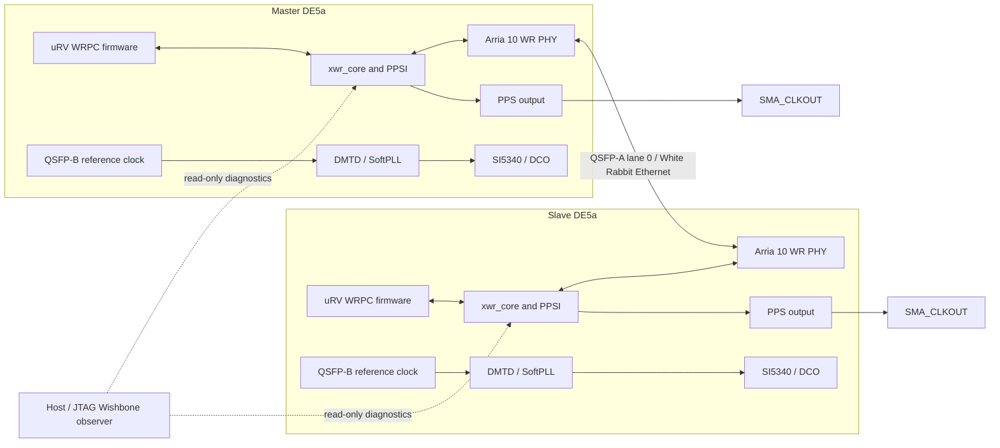

# DE5a White Rabbit

This repository develops and records the two-board White Rabbit system on Terasic DE5a / Arria 10. The only intended current hardware workflow is the JTAG-based Master/Slave design; frozen milestone snapshots preserve each validated research checkpoint.

## Current code and four-step workflow

**Current root: strict WR validity candidate, NOT YET QUALIFIED.**
Active experiment: `EXP-S6-COHERENT-FOUR-TIMESTAMP-RTT-DIAGNOSTIC-20261003`.
Current source restores normal /2 acquisition + /12 tracking and adds a passive
same-update four-timestamp/RTT RAM history. Fresh two-board build/program from
`4e0c2324095c8644dac7fb5426f69de0eadb392c` completed; root output contains those
actual diagnostic SOFs, NOT a strict300s PASS milestone. All16consecutive
timestamp records passed identities. Action-free ~8.2ns return-leg jumps
correspond to ~4.2ns CKO jumps. The120s acquisition observation reached<60ps,
but qualified hold was only2102ms; postflight did not satisfy the extension
gate. See the [completed report](experiments/step6/EXP-S6-COHERENT-FOUR-TIMESTAMP-RTT-DIAGNOSTIC-20261003/REPORT.md).
The preceding completed fixed-setpoint diagnostic had fresh
two-board builds and one Slave→Master programming pair succeeded from
`fbd8febf3eab38e6d2734f859d911f1e6b10365f`; those products are now superseded.
In that previous diagnostic, first strict entry froze WR setpoint, but >120ps
still revoked Slave time, without automatic re-enable in that boot. This was NOT
a production PASS image. Late-entry read-only capture found CKO/DMS jumps near
4ns with unchanged WR phase-write/init counts and SETP; 38 fresh updates did
not meet the preset 40-update diagnostic gate. Strict 300s remains
NOT_ESTABLISHED, diagnostic INCONCLUSIVE. See the
[report](experiments/step6/EXP-S6-FIRST-ENTRY-FIXED-SETP-STRICT-VALIDITY-20261003/REPORT.md).
Preceding source added passive packet-specific timestamp RAM snapshots;
both fresh compiles/programming completed from
`13d5c99b2b1898cf9cd9d9864288f7f9d5cccccf`, now superseded by the fixed-SETP build.
The90s preflight reached <60ps with a2669ms qualified span, not300s. Packet
math validated, but fine stability remains NOT_ESTABLISHED; see the
[RXTS report](experiments/step6/EXP-S6-RXTS-RAW-AHEAD-PHASE-DIAGNOSTIC-20261003/REPORT.md).
The requested gate now also requires a <60 ps acquisition and a 300 s interval
within +/-120 ps, with Slave validity revoked on excursions. The old
TIME_VALID-only pass does not prove this. The preceding role-corrected candidate
was compiled from `4ba9df5935fc0a6afae2c7bd29603f190936e627`
and programmed on 2026-10-02. Master validity was restored; its completed660s
strict capture had no <60 ps entry, CKO -3158..+3839 ps, and no qualified hold.
Slave correctly remained invalid. These are NOT PASS
milestone images. Any further production-source change still requires rebuild.

**Historical Step6 TIME_VALID-only PASS — two root cycles (2026-10-02).**
Historical experiment: `EXP-S6-MASTER-HPLL-STEP64-REPEATABILITY-20261002`.
Each cycle freshly built firmware, fully compiled both FPGA projects, programmed
Slave then Master, and sampled each board for more than 300 seconds.
All four windows had 1192/1192 TIME_VALID rows; no invalid rows or transport
errors. The two cycles used identical 3110 production inputs and firmware MIFs.
See the [qualification report](experiments/step6/EXP-S6-MASTER-HPLL-STEP64-REPEATABILITY-20261002/REPORT.md).
The frozen Step6 package also passed a new full independent-directory
build/compile/program reproduction: Master/Slave 1192/1192 valid rows over
302952/302872 ms. See the [standalone rebuild report](experiments/step6/EXP-S6-MILESTONE-STANDALONE-FRESH-REBUILD-TIME-VALID-300S-20261002/REPORT.md).

The production change is Master `HPLL_TRACKER_CODE_PER_PHYSICAL_STEP` 34 → 64;
Master bootstrap remains 2048, Slave control remains `/2 acquisition + /12 tracking`.
Master Helper was locked and its phase tracker ready after qualification.
The earlier byte-identical bootstrap2048 archive failed after reprogramming:
copy equality alone was not reproduction evidence. That failure is retained
in the new report, not hidden by this PASS.

The [single Step6 milestone](artifacts/milestones/step6_global_time/README.md)
contains the qualified source, all scripts/dashboard, products and evidence.
Run `prepare_source.sh` there and use its independent `source/` directory.
Only `artifacts/milestones/` holds frozen operational snapshots;
`experiments/` holds evidence, not a different current build entrypoint.
This is the user's sampled TIME_VALID-only gate. Sequential board reads do
not establish physical time accuracy, cycle-by-cycle continuity, offset <60 ps,
or universal startup reliability. Timing closure is not required.

Run on Pain from `/home/b10504072/04_WR`:

```sh
bash scripts/build/build_current.sh          # 1. build firmware
bash scripts/build/compile_current.sh        # 2. compile both FPGA images
bash scripts/program/program_current.sh      # 3. program Slave, then Master
bash scripts/monitor/step1_6_dashboard.sh      # 4. live read-only dashboard
```

The retained images are `output/DE5a_wr_master_jtag.sof` and `output/DE5a_wr_slave_jtag.sof`, with build metadata and checksums. Firmware binaries/MIF and compile reports are retained in `build/`. Stop the dashboard before running any verifier. `bash scripts/monitor/verify_time_valid_300s.sh` checks the historical TIME_VALID-only gate; the current strict goal instead requires `bash scripts/monitor/verify_strict_offset_time_valid_300s.sh` and its coherent fresh-offset/Master-health checks. Neither the dashboard nor the old bit-only verifier establishes the strict goal. Timing closure is not a gate.

Firmware version text stays pinned for reproducibility; the passive diagnostic changes the MIF and has separately pinned hashes. `output/SOURCE_COMMIT` records the real checkout used for compilation. Until the new compile/export finishes, retained `output/` files still belong to the preceding build; the source-manifest gate prevents programming those stale files as the new source.

## System architecture


```mermaid
flowchart LR
  subgraph M[Master DE5a]
    MCPU[uRV WRPC firmware] <--> MCORE[xwr_core and PPSI]
    MCORE <--> MPHYS[Arria 10 WR PHY]
    MREF[QSFP-B reference clock] --> MDMTD[DMTD / SoftPLL]
    MDMTD --> MDCO[SI5340 / DCO]
    MCORE --> MPPS[PPS output]
  end
  subgraph S[Slave DE5a]
    SCPU[uRV WRPC firmware] <--> SCORE[xwr_core and PPSI]
    SCORE <--> SPHYS[Arria 10 WR PHY]
    SREF[QSFP-B reference clock] --> SDMTD[DMTD / SoftPLL]
    SDMTD --> SDCO[SI5340 / DCO]
    SCORE --> SPPS[PPS output]
  end
  MPHYS <-->|QSFP-A lane 0 / White Rabbit Ethernet| SPHYS
  JTAG[Host / JTAG Wishbone observer] -. read-only diagnostics .-> MCORE
  JTAG -. read-only diagnostics .-> SCORE
  MPPS --> MSMA[SMA_CLKOUT]
  SPPS --> SSMA[SMA_CLKOUT]
```

The diagram is a functional overview, not a pin-level schematic. Each board runs the White Rabbit core and WRPC firmware; the Master and Slave roles use unique endpoint identities. QSFP-A lane 0 is the fixed inter-board WR Ethernet data path. The local reference clock feeds DMTD; SoftPLL uses DMTD phase measurements to control the SI5340-based DCO. The WR core's PPS output is routed to `SMA_CLKOUT`. A healthy PHY/link indication alone does not prove valid PTP time, PPS, SoftPLL lock, or global-time agreement.

The current design uses the Arria 10 White Rabbit PHY and its required generated IP inputs. Master and Slave are separate JTAG Quartus projects with the top-level entities shown below. On Pain, the board cables are `DE5 [1-11.1]` for Master and `DE5 [1-11.2]` for Slave. Runtime status and Wishbone-register observation use the JTAG scripts under `scripts/jtag/`; the Step 1–6 dashboard is read-only.

The RS422-named pins in the JTAG top-level are retained only as the board's
WRPC physical-UART console sideband. They do not define a second White Rabbit
architecture or a build/program/diagnostic workflow; all current FPGA project
builds/programming and all milestone acceptance/diagnostic observations use
JTAG. The UART sideband may be used only as the WRPC text console.

Canonical Quartus top-level entities:

```text
DE5a_wr_master_jtag
DE5a_wr_slave_jtag
```

## Current milestone status

Steps 1–5 retain independently validated frozen checkpoints. The single Step6
package is now the Master-step64 version qualified by two fresh complete root
cycles. Current images are in `output/`. Earlier common-PPS/digital-trigger
results remain in their experiment reports, not as a second Step6 package.
See [STATUS.md](STATUS.md) and [MILESTONES.md](MILESTONES.md).

## Reproduce the validated Step 2 checkpoint

Quartus Prime Standard Edition 17.0.0 Build 595 and the RISC-V firmware toolchain are used by the validated milestone. On Pain, set the Quartus executables and toolchain `PATH`, then run from the repository root:

```sh
cd artifacts/milestones/step2_endpoint_ptp/source
bash scripts/build/build_master.sh
bash scripts/build/build_slave.sh
CABLE='DE5 [1-11.1]' bash scripts/program/program_master.sh
CABLE='DE5 [1-11.2]' bash scripts/program/program_slave.sh
```

The programming wrappers use the freshly built JTAG images in that frozen source directory. The validated order for this Step 2 reproduction was Master then Slave. Build success alone is not runtime validation; use the acceptance procedure in the milestone README and experiment report.

## Reproduce the validated Step 3 checkpoint

The exact Step 3 SOF files programmed and validated on 2026-09-24 are:

- Master: [`artifacts/milestones/step3_wr_handshake/master.sof`](artifacts/milestones/step3_wr_handshake/master.sof)
- Slave: [`artifacts/milestones/step3_wr_handshake/slave.sof`](artifacts/milestones/step3_wr_handshake/slave.sof)

On Pain, the independent build outputs are under
`artifacts/milestones/step3_wr_handshake/source/quartus/output_files_master_jtag/DE5a_wr_master_jtag.sof`
and
`artifacts/milestones/step3_wr_handshake/source/quartus/output_files_slave_jtag/DE5a_wr_slave_jtag.sof`.
Their SHA-256 hashes match the two files above. Program Master first, then
Slave, using the wrappers in
`artifacts/milestones/step3_wr_handshake/source/scripts/program/`. See the
[Step 3 milestone README](artifacts/milestones/step3_wr_handshake/README.md)
for the exact verification boundary and limitations.

## Reproduce the validated Step 4 SoftPLL-startup checkpoint

The exact Step 4 SOFs rebuilt from the frozen source and programmed on
2026-09-24 are:

- Master: [`artifacts/milestones/step4_softpll_startup/master.sof`](artifacts/milestones/step4_softpll_startup/master.sof)
- Slave: [`artifacts/milestones/step4_softpll_startup/slave.sof`](artifacts/milestones/step4_softpll_startup/slave.sof)

Their SHA-256 hashes are recorded in the milestone `SHA256SUMS` and
`MILESTONES.md`. The independent source snapshot is
`artifacts/milestones/step4_softpll_startup/source/`. Rebuild both projects
from that directory with the wrappers documented in its README. The validated
programming order was Master, wait approximately 45 seconds, then Slave. Use
the acceptance procedure and known limitations in the
[Step 4 milestone README](artifacts/milestones/step4_softpll_startup/README.md)
and the
[Step 4 reproduction report](experiments/step4/EXP-S4-MILESTONE-REPRO-20260924/REPORT.md).

## Reproduce the validated Step 5 full-lock checkpoint

The exact Step 5 SOFs rebuilt and validated on 2026-09-24 are:

- Master: [artifacts/milestones/step5_softpll_lock/master.sof](artifacts/milestones/step5_softpll_lock/master.sof), SHA-256 f72501285cef7f6a892b9334e7de93a5a86f8aff7311417f577c14acfd213a30.
- Slave: [artifacts/milestones/step5_softpll_lock/slave.sof](artifacts/milestones/step5_softpll_lock/slave.sof), SHA-256 d4efd77c91ddc96cd6444e3f47cadf529a4f19da4c9f6b0876ce00557d63ca20.

The independent frozen build source is artifacts/milestones/step5_softpll_lock/source/. On Pain, with the recorded Quartus and RISC-V toolchains on PATH:

```sh
cd artifacts/milestones/step5_softpll_lock/source
bash scripts/build/build_firmware.sh master
bash scripts/build/build_master.sh
bash scripts/build/build_firmware.sh slave
bash scripts/build/build_slave.sh
CABLE='DE5 [1-11.1]' bash scripts/program/program_master.sh
CABLE='DE5 [1-11.2]' bash scripts/program/program_slave.sh
```

The validated program order was Master, wait at least 90 seconds, then Slave; wait at least 120 seconds after both before read-only preflight. The 300-second F4L invocation and full acceptance evidence are in the [Step 5 reproduction report](experiments/step5/EXP-S5-MILESTONE-REPRO-20260924/REPORT.md). The [Step 5 milestone README](artifacts/milestones/step5_softpll_lock/README.md) records the exact acceptance boundary and caveats.

## Reproduce the validated Step 6 TIME_VALID checkpoint

The current Step 6 research index, including successful and failed runs, is
[`experiments/step6/README.md`](experiments/step6/README.md).

The exact second-cycle Step6 SOFs compiled and programmed on 2026-10-02 are:

- Master: [master.sof](artifacts/milestones/step6_global_time/master.sof), SHA-256 `9f66cef3f06697085325916126e6da61d76ace7138e7203af068df1a69d30036`.
- Slave: [slave.sof](artifacts/milestones/step6_global_time/slave.sof), SHA-256 `b92e3356580691814e113e8c3278f1044bee621e2808d207541c9efc3ba59727`.

On Pain, prepare the standalone source and then use its original scripts:

```sh
cd artifacts/milestones/step6_global_time
bash prepare_source.sh
cd source
bash scripts/build/build_current.sh
bash scripts/build/compile_current.sh
bash scripts/program/program_current.sh
bash scripts/monitor/step1_6_dashboard.sh
```

To program the frozen milestone SOFs, from the same `source/` directory use
Slave first, then Master:

```sh
SOF=../slave.sof CABLE='DE5 [1-11.2]' bash scripts/program/program_slave.sh
SOF=../master.sof CABLE='DE5 [1-11.1]' bash scripts/program/program_master.sh
```

Stop the dashboard before running `bash scripts/monitor/verify_time_valid_300s.sh`.
The [milestone README](artifacts/milestones/step6_global_time/README.md) documents
retained-image programming without rebuilding, checksums and external tools.
Historical digital-trigger evidence remains in its experiment reports;
physical SMA skew is not claimed by this TIME_VALID qualification.

## Current development source, build, and programming

The canonical JTAG projects are flattened directly under `quartus/`. The
Quartus-generated PHY/IP inputs required by the build are under
`quartus_generated/`, and the SI5340 controller RTL is under
`quartus/si5340_controller/`. Current development uses only
`DE5a_wr_master_jtag` and `DE5a_wr_slave_jtag`. The RS422 UART sideband is not
an alternate project or management path; the QSFP-B reference-clock input is
not the inter-board White Rabbit packet link.

Use Quartus Prime Standard Edition 17.0.0 Build 595 and the RISC-V firmware
toolchain recorded in the experiment provenance. From the repository root on
Pain, use the pinned current-root wrappers to build firmware and clean-compile
both canonical Quartus projects (including retained-output export):

```sh
bash scripts/build/build_current.sh
bash scripts/build/compile_current.sh
```

`QUARTUS_BIN` may be set to the installed Quartus `bin` directory; the default
is `/mnt/ds1515/opt/intelFPGA/17.0/quartus/bin`. Then program the matching JTAG
images with source/MIF/SOF checks and the current experiment's programming order:

```sh
bash scripts/program/program_current.sh
```

The freshly built current-development SOFs are:

```text
Master: output/DE5a_wr_master_jtag.sof
Slave:  output/DE5a_wr_slave_jtag.sof
```

These are not frozen milestone binaries. For a validated checkpoint, use the
paired SOFs in `artifacts/milestones/stepX_*/` and the matching independent
source snapshot under that directory's `source/`. For example, the Step 3
handshake pair is `artifacts/milestones/step3_wr_handshake/master.sof` and
`slave.sof`.

Run the live, read-only dashboard from the repository root with
`bash scripts/monitor/step1_6_dashboard.sh`. It samples every 10 seconds by
default. `WAIT_FOR_GLOBAL_TIME_SECONDS` is an optional maximum wait for all
visible boards to satisfy the Step 1 and Step 6 gates; it is not a required
fixed delay. Its default is `0`, so a live dashboard displays the current
state immediately. A value such as `120` is a host-side maximum selected by
the caller—not an FPGA timeout and not a mandatory 120-second delay. If that
maximum expires, the result is `INCOMPLETE`, not a hardware-failure verdict;
the dashboard still prints the latest state. Continuous monitoring always
shows each sample immediately and ignores this optional wait; use `ONCE=1`
when deliberately requesting a one-shot readiness gate. On an invalid Slave
Global-Time gate, the panel also shows the WR PTP servo state and signed phase
offset. In `WAIT_OFFSET_STABLE`, the firmware withholds timing output until
the offset is below its source-defined 60 ps threshold; that is how firmware
first asserts TIME_VALID. The historical frozen milestone checked a300-second
TIME_VALID-only hold. The CURRENT root instead requires fresh strict<60ps
acquisition, then inclusive+/-120ps retention with live invalidation outside
that band, plus300seconds of qualified fresh offset/time/Master-health samples.
The exported status bit or dashboard alone cannot establish this stricter gate.

## Source and evidence policy

- Current development source is `quartus/`, `quartus_generated/`,
  `firmware/`, `vendor/`, and `scripts/`.
- `artifacts/milestones/stepX_*/source/` is frozen, self-contained historical
  source. Do not edit it for ordinary development.
- `experiments/stepX/EXP-.../` stores experiment plans, raw build/program
  evidence, runtime captures, analysis, reports, and checksums.
- `experiments/legacy/` retains imported historical reports under their
  original group layout; they are evidence, not current design instructions.
- A milestone is PASS only after its own frozen source is clean-built,
  programmed on both DE5a boards, and passes that step's runtime criteria.
  Never use a later-step SOF to stand in for an earlier checkpoint.
- Record historical and rebuilt SOF hashes separately. Build success alone is
  not runtime validation; report timing closure separately from functional
  status.

Repository directories:

| Path | Purpose |
|---|---|
| `quartus/` | Current Master/Slave JTAG projects and project-owned RTL. |
| `quartus_generated/` | Version-controlled Quartus/Qsys generated PHY/IP build inputs. |
| `firmware/` | Master/Slave WRPC firmware configuration and build scripts. |
| `vendor/` | Pinned White Rabbit RTL and firmware dependencies. |
| `scripts/` | Build, program, JTAG, monitoring, analysis, and test tools. |
| `experiments/` | Step-indexed research records and raw evidence. |
| `artifacts/milestones/` | Frozen, independently reproducible step checkpoints. |

Every milestone has its own source snapshot and is marked PASS only after that snapshot is clean-built, programmed on both DE5a boards, and passes its own runtime acceptance criteria. Never use a later-Step SOF to stand in for an earlier milestone. Historical SOF hash mismatches are recorded, not hidden. Timing closure is reported separately and is not silently inferred from functional PASS.

See [`artifacts/README.md`](artifacts/README.md) for artifact policy and [`experiments/README.md`](experiments/README.md) for evidence conventions.
