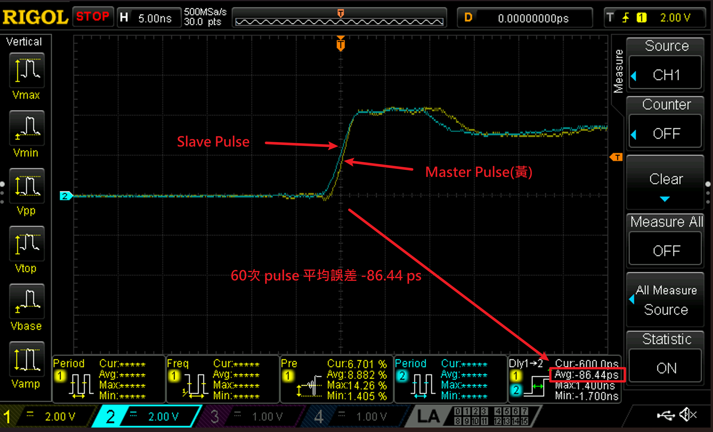

# Step7 milestone：實體 PPS 奈秒等級對齊（唯讀封存）

封存整理日期：2026-10-07；分支：`step7-physical-measurement`。
此 milestone 保存目前 Step7 的完整程式與操作流程，以及使用者提供的示波器觀測。
**階段性實體同步驗證：已觀察到奈秒等級對齊；不宣稱已校準的皮秒精度。**



## 觀測摘要

儀器為 RIGOL DS1104Z Plus，500 MSa/s（2 ns/sample），5 ns/div。
Master=CH1 黃色、Slave=CH2 青色。PPS 設定為每秒一次、脈寬 10 ms；
125 MHz clock 的週期為 8 ns，10 ms 對應 1,250,000 個 clock ticks。
SMA_CLKOUT 連接 `pps_p_o`，不是連續的 125 MHz clock。

圖上標註 60 次 pulse：延遲平均 −86.44 ps，最小 −1.700 ns、最大 +1.400 ns，
顯示統計範圍 3.100 ns。使用者未見明顯漂移；沒有逐筆資料可量化長時間漂移。
插值／邊緣估計、頻寬、雜訊與未校準的線材／通道 skew 影響準確度，
所以不把 −86.44 ps 解讀為已驗證的物理同步精度。
[完整觀測、來源與限制](VERIFICATION.md)。

## 封存內容

- `source.tar.gz`：完整 `firmware/`、`vendor/`、`quartus/`、`quartus_generated/`、
  `scripts/`（含 dashboard）、`build/`、`output/` 與成功的 Step7 恢復／本次觀測紀錄。
- `master.sof`、`slave.sof`：目前 Step7 的實際保留 SOF，與 root output 相同。
- `master-slave-pulse.png`、`VERIFICATION.md`：原始使用者圖檔與本次報告。
- `PACKAGE.json`、`SHA256SUMS`：封存來源與完整性紀錄，不是新增主程式操作門檻。
- `prepare_source.sh`：將封存解開到**封存外**的全新、可編輯工作目錄。
- `seal_read_only.sh`：只把本 Step7 封存設為不可寫；Git 不保存唯讀權限。

build source 為 `4d7e38189e26707afffb2ecc404f3ad0e8a08326`，
Slave bootstrap=512、Master=2048、acquire `/2`／track `/12`、60/120 ps 不變。
封存的 snapshot commit 見 PACKAGE.json，與實際 compile source 分開記錄。
截圖 loaded-image 身分未獨立核實。本次未重做 build/program 或 TIME_VALID 300 秒驗證。
Step6 的既有 300 秒 PASS 與其唯讀封存維持原樣。

## 使用方式（Pain，從封存外重現）

先建立獨立工作目錄；指定的目的地必須尚不存在：

```sh
cd /home/b10504072/04_WR
bash artifacts/milestones/step7_physical_measurement/prepare_source.sh /home/b10504072/04_WR_step7_reproduction
cd /home/b10504072/04_WR_step7_reproduction
```

只想使用已封存的 SOF 時，停止其他 JTAG reader 後，可從該工作目錄執行後兩步。
若要重新建置，按現有四步驟依序執行，前一步成功後才繼續：

```sh
bash scripts/build/build_current.sh
bash scripts/build/compile_current.sh
bash scripts/program/program_current.sh
bash scripts/monitor/step1_6_dashboard.sh
```

需要既有 Pain 的 RISC-V 工具鏈與 Quartus 17.0；封存不包含作業系統、工具鏈或授權。
新的 SOF 會寫入外部工作目錄的 `output/`，不改封存。
恢復檔案不保證每次硬體啟動都能鎖定，也不自動代表新的實體或 300 秒 PASS。

## 唯讀政策

**不要在此資料夾內建置、寫 log、解包 source/ 或修改檔案。**
Pain 上以檔案／目錄的 write permission 移除作防誤寫；Laptop 檔案設唯讀屬性。
擁有者仍可改權限，不宣稱這是不可撤銷的 WORM 儲存。
新 clone 或 checkout 不會自動保留唯讀權限，可在確認封存完整後執行：

```sh
bash artifacts/milestones/step7_physical_measurement/seal_read_only.sh
```

此命令只作用於 Step7，絕不修改 Step1–6 或受保護的 Pain archive。
